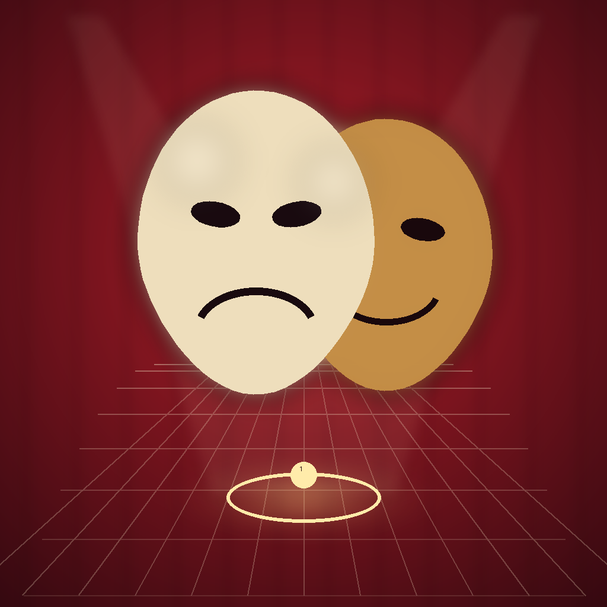

# Understudy

**Multiplayer spatial theater — and film pre-viz. A Vision Pro director, iPhones and Android performers, a Python relay for cross-platform rehearsals, and the full text of Hamlet, Macbeth, and A Midsummer Night's Dream tappable in your pocket.**

Understudy turns a real room into a programmable stage.

A **director** wearing Apple Vision Pro places blocking marks on the floor — actual points in 3D space — and attaches lines, sound cues, light cues, and beats to each one. **Performers** hold phones that become smart teleprompters: walk onto a mark, your phone pulses, the next line appears, the sound fires, the "amber" light washes the room. The director sees every performer as a ghost avatar moving through the same virtual stage, in real time.

Record a blocking once and anyone else with a phone can *walk it back* — the app becomes a self-paced AR audio tour of your own show. Site-specific theater becomes shareable. Rehearsal becomes async. The audience can literally step into the actor's path after the curtain falls.

And because three whole Shakespeare plays are bundled in the app, you don't have to type a single line. Drop a mark at Francisco's post, open the Script Browser, tap Bernardo's "Who's there?" — it's on the mark. Tap the next line, the next.

As of v0.8, the same model serves **film directors, DPs, and location scouts**: drop virtual camera marks with real lens specs (14/24/35/50/85/135mm), see FOV wedges in the room, and use the phone as a literal viewfinder that shows what each lens would frame from each spot.



> *"Figma for stage direction."*

---

## Who this is for

| You are… | Understudy gives you… |
|----|----|
| **A theater director or stage manager** | Block scenes without a venue. Save blockings as files, share them with your cast, rehearse remotely. Fire real QLab cues over OSC. The full text of Hamlet, Macbeth, and Midsummer is tappable. |
| **A film director or DP location-scouting** | Drop virtual camera marks with real lens specs (14/24/35/50/85/135mm) and see their FOV wedges anchored in the real room. The phone is a viewfinder — see what each lens frames from each spot *before* the shoot. |
| **An architect designing a venue** | Walk sightlines and circulation paths with real bodies before construction. Mix actor marks and camera marks to rehearse a venue's cinematic use. |
| **An XR pre-viz team** | Scout spatial choreography with phones you already have, before you commit to MoCap or a game engine. |
| **An immersive experience designer** | Prototype interactive paths and cue chains in a day. Audience mode ships a finished product. |
| **A curious person on a Sunday** | Tap your floor a few times and walk a five-mark Hamlet abridgement while your phone delivers the lines. Ninety seconds. |

---

## The stack

```
┌──────────────────────────┐      MPC / LAN       ┌──────────────────────────┐
│  Apple Vision Pro        │◄────────────────────►│  iPhone                  │
│  DIRECTOR                │    (auto-Bonjour)    │  PERFORM / AUTHOR /      │
│                          │                      │  AUDIENCE                │
│  • tap to place marks    │                      │                          │
│  • edit cues & scripts   │                      │  • live AR stage         │
│  • see performer ghosts  │                      │  • tap-floor to author   │
│  • floating script pages │                      │  • camera marks +        │
│  • scrub recorded walks  │                      │    viewfinder overlay    │
│  • OSC out to QLab       │◄──WebSocket relay──►│  • shared-origin calib   │
└──────────────────────────┘         (JSON)       └──────────────────────────┘
                                       ▲
                                       │
                           ┌──────────────────────┐
                           │  Android phone       │
                           │  PERFORM / AUTHOR    │
                           │  (ARCore + OkHttp)   │
                           └──────────────────────┘
```

Apple devices on the same LAN find each other automatically over Bonjour and exchange state via **MultipeerConnectivity** — no setup, no server. When Android needs to join (or you want a remote rehearsal), spin up the Python relay on any Mac/Linux box and switch every app's Transport to **WebSocket relay**. Same wire format, same rooms, same cues.

---

## Modes — what happens when you launch

On visionOS, you're always the **Director**. On iPhone / Android, a first-launch picker asks what you're here for:

### Perform
Walk the blocking. A full-screen AR camera feed behind a dark curtain gradient shows where the marks are as glowing discs on the floor; a guidance ring shrinks as you approach the next one. Haptic pulse on entry. The next line materialises in serif type over the camera feed. System-sound SFX cues fire; screen flashes for light cues.

### Author (iPhone + Android)
Tap the floor to drop a mark at the raycast point. Tap an existing mark to open the inline editor — name, radius, lines (with character labels), sounds, lights, holds, director notes. A **"Pick from Hamlet…"** button opens the full Shakespeare library (three plays) with search, scene filter, and already-used indicators. **"Drop whole scene"** auto-lays out a zig-zag path of marks in front of you with every line pre-populated.

In Author mode on iPhone, a segmented picker at the top switches between actor and **camera** marks. Camera marks come with lens-preset pills (14/24/35/50/85/135mm) and a **live viewfinder overlay** that shows exactly what the selected lens would frame from the phone's current viewpoint — rule-of-thirds grid, lens+HFOV chip, dimmed exterior.

Export as `.understudy` JSON (pretty-printed, hackable, identical to the wire format) via the share sheet. Import from the file picker. Autosave means edits survive relaunches.

### Audience (iPhone)
The show comes to you. Site-specific theater as a finished product: a big "Begin" card, a progress bar across the whole walk, stripped-down cue presentation (director notes hidden; light cues narrated in prose). Over the wire you're an `observer` so the director can see your position without you affecting the main cueing logic.

---

## Getting started — ninety seconds to Hamlet

1. Open `Understudy.xcodeproj` in Xcode 15.4+.
2. Pick any iOS simulator or device → **Run**.
3. First launch → pick **Perform**.
4. Allow camera permission. A five-mark Hamlet opening (Elsinore battlements) is pre-loaded: Francisco's post → Bernardo enters → center → Horatio arrives → the Ghost.
5. Walk toward the first glowing mark. When you arrive, your phone pulses, a cool-blue light cue washes the screen, and Francisco speaks.

If you have a Vision Pro, run the same scheme to a visionOS simulator — both sides find each other on Wi-Fi.

For the full multi-device flow (Apple + Android + relay), see **[QUICKSTART.md](QUICKSTART.md)**.

---

## What's in this repo

```
Understudy/                        Swift source (iOS + visionOS, single target)
├── UnderstudyApp.swift            App entry + mode router + AR host lifecycle
├── Info.plist / .entitlements
├── Assets.xcassets/               App icon + accent color
├── Resources/
│   ├── hamlet.json                Full play — 5 acts, 20 scenes, 1108 lines
│   ├── macbeth.json               Full play — 5 acts, 28 scenes, 647 lines
│   └── midsummer.json             Full play — 5 acts, 9 scenes, 484 lines
├── Models/
│   ├── CoreModels.swift           Pose, Mark, Cue, MarkKind, CameraSpec, Blocking, Performer, ID, LightColor
│   └── Version.swift              CFBundle version shown in UI
├── Shared/
│   ├── AppMode.swift              Perform / Author / Audience enum
│   ├── BlockingStore.swift        @Observable state, mark entry → cue firing
│   ├── BlockingFile.swift         .understudy FileDocument + UserDefaults autosave
│   ├── DemoBlockings.swift        The bundled Hamlet 5-mark demo
│   ├── DeviceCalibration.swift    Shared-origin transform (toBlocking / toRaw)
│   ├── ScenePlacer.swift          "Drop whole scene" layout algorithm
│   ├── Script.swift               PlayScript model + Scripts.{hamlet, macbeth, midsummer}
│   ├── WireCoding.swift           JSONEncoder/Decoder with ISO-8601 dates
│   └── Effects/
│       ├── CueFXEngine.swift      System sounds, flash state, hold countdowns, preview
│       └── OSCBridge.swift        OSC 1.0 UDP sender (QLab / TouchDesigner / Max)
├── Networking/
│   ├── Transport.swift            Protocol — swappable MPC / WebSocket
│   ├── MultipeerTransport.swift   Apple-to-Apple on LAN
│   ├── WebSocketTransport.swift   Through /relay/server.py for Android
│   └── SessionController.swift    Wires store mutations to the wire
├── iOSApp/
│   ├── PerformerView.swift        Teleprompter + SettingsSheet + FlashOverlay + PerformerARHost
│   ├── AuthorView.swift           Tap-to-place, MarkEditorSheet, drop-kind + lens pickers
│   ├── AudienceView.swift         Self-paced tour with progress bar
│   ├── ModeSelector.swift         First-launch three-card picker
│   ├── ScriptBrowser.swift        Hamlet/Macbeth/Midsummer picker → .line cues
│   ├── ARPoseProvider.swift       ARKit → Pose, applies calibration
│   ├── CalibrationButton.swift    Compass icon + menu in every mode's top bar
│   ├── ViewfinderOverlay.swift    Lens FOV framing rectangle on camera feed
│   └── AR/ARStageContainer.swift  RealityKit scene: floor-anchored marks, ghost, trail, camera rigs
└── VisionOS/
    ├── DirectorControlPanel.swift Floating window — room, transport, marks, transport strip, OSC
    ├── DirectorImmersiveView.swift RealityKit immersive stage + camera rigs + ghost + light wash
    └── MarkScriptCard.swift       Floating "manuscript page" attachment next to each mark

android/                           Android Studio project — Kotlin + Compose + ARCore + OkHttp
relay/                             Python WebSocket relay (single file, one pip dep)
scripts/                           parse_hamlet.py — Gutenberg plaintext → Resources/*.json
test-fixtures/                     Swift-generated JSON fixtures for wire-format round-tripping
Understudy.xcodeproj
PROTOCOL.md                        Authoritative wire format docs
QUICKSTART.md                      How to run the whole stack on a LAN
OSC.md                             OSC bridge output protocol (→ QLab etc.)
```

### Architecture at a glance

- **Single Swift target** builds for iOS and visionOS. `#if os(iOS)` / `#if os(visionOS)` routes the view.
- **Models are pure value types** — `Codable`, `Sendable`, `nonisolated`. They cross actor boundaries and serialize trivially. `Mark` decodes older files without `kind` or `camera` keys, defaulting to `.actor` / `nil` — v0.1–v0.7 blockings still load unchanged in v0.8.
- **`BlockingStore` is an `@Observable` MainActor**. Mark entry enqueues `FiredCue`s into `cueQueue`; `CueFXEngine` drains the queue and actually does things (system sounds, screen flashes, visionOS stage wash, OSC out).
- **`Transport` protocol** abstracts the wire. `MultipeerTransport` for pure Apple (Bonjour `_und-stage._tcp`). `WebSocketTransport` for mixed environments including Android, via the relay. Hot-swappable at runtime from Settings.
- **`WireCoding`** is the shared `JSONEncoder`/`Decoder` with ISO-8601 dates — cross-platform safe. Kotlin's polymorphic adapter matches Swift's default Codable enum shape; `test-fixtures/` catches any drift.
- **Cue firing on transition edge** — cues fire on mark *entry*, not every frame the performer is inside the radius. No re-triggering when you wiggle.
- **Autosave on every mutation** — `addMark` / `updateMark` / `removeMark` / `addCue` / `stopRecording` / import / snapshot sync all persist to UserDefaults.
- **Shared-origin calibration** is device-local state on `PerformerARHost.shared.calibration`, not broadcast. Each device owns its own transform from raw AR frame ↔ shared blocking frame. Set via the compass button; floor-plane (yaw-only) rotation + translation.
- **Camera marks bypass the walk sequence** (`sequenceIndex: -1`) so they don't mix into the performer teleprompter flow — they're pre-viz references, not cue points.
- **OSC → QLab** is one-way UDP from any device whose `OSCBridge` is enabled. Cue firings emit `/understudy/cue/line|sfx|light|wait|note` + one `/understudy/mark/enter` per mark transition. See `OSC.md` for the protocol.

### Wire format

See [PROTOCOL.md](PROTOCOL.md). Short version: every message is a JSON `Envelope` carrying a `NetMessage` enum variant. Swift's default Codable emits enum cases as `{"caseName": {"_0": value}}` for unlabeled associated values and `{"caseName": {"label": value}}` for labeled ones — Kotlin matches with a polymorphic adapter in `android/app/src/main/java/agilelens/understudy/net/Envelope.kt`. Round-trip fixtures in `test-fixtures/` catch drift.

### Running the relay

```bash
cd relay
python3 -m venv .venv && source .venv/bin/activate
pip install -r requirements.txt
python3 server.py
# Understudy relay starting on ws://0.0.0.0:8765
```

Then in every app's Settings (gear icon) → Transport → WebSocket, enter `ws://<relay-host-lan-ip>:8765`.

---

## Roadmap

*(Latest first. Every version shipped is a real commit + push; the "Next up" list is intentional future work.)*

### Next up
- [ ] Migrate Monitoring code to AgileLensMultiplayer SPM dependency (currently copied in)
- [ ] Gestural rotation on visionOS 2.0 target — v0.12 translates via drag but rotates via ±15° buttons (1.0 has no `RotateGesture3D`). Uniform scale still unbuilt — add when there's a use case beyond "1:1 scale is what I want."
- [ ] Android LiDAR pass-through (ARCore Depth API on supported devices)
- [ ] More modern plays — `parse_modern.py` works for Chekhov + Wilde; try Cherry Orchard, Ghosts (Ibsen), Three Sisters, Salomé. Beckett's copyright expires in 2059 in Europe so is off the table.
- [ ] QR-code anchor as a more precise alternative to the "stand here, face upstage" calibration ceremony
- [ ] Android floating script panels (feature parity with visionOS)
- [ ] Android Audience mode + camera marks
- [ ] OSC receiver (bi-directional: listen for `/understudy/go` etc.)
- [ ] DMX direct output (sACN / Art-Net)
- [ ] Lens/sensor pickers with real-world presets (ARRI, RED, Sony FX, cine primes)
- [ ] Public-domain Chekhov + Beckett in the Script Browser
- [ ] TestFlight

### v0.12 · Align the scouted room to the rehearsal room
Completes the v0.9 LiDAR story. The scan was capturable and visible, but not alignable — so if your Brooklyn rehearsal studio and your scouted Manhattan loft weren't already sharing a coordinate frame (and they never are), the ghost floated in the wrong place.

- **Draggable ghost on visionOS.** The scan entity gets a coarse bounding-box `CollisionComponent` (cheap — derived from vertex bounds, not per-triangle) and an `InputTargetComponent`. A `DragGesture.targetedToAnyEntity()` translates the ghost on the floor plane when the alignment lock is open. Y is pinned so the floor stays aligned with the real floor.
- **Rotation via buttons.** visionOS 1.0 has no `RotateGesture3D`, so rotation is two buttons in the director panel's new "Scan align" strip — ±15° increments. (Gestural rotation is a v2.0-target item.)
- **Lock by default.** `BlockingStore.scanAlignmentLocked` gates drag + buttons so the ghost doesn't drift mid-rehearsal from an accidental tap. Toggle off ("Align") to enter edit mode.
- **Reset** button clears any drift back to scan origin.
- **Live broadcast.** Every committed move emits `roomScanOverlay(Pose)` over the wire (message case shipped in v0.9) so every peer's ghost re-renders in the new pose without re-transmitting the mesh. Autosave on each commit.
- Align strip in the director panel shows the scan's name, triangle count, and current offset ("`+0.85m, +45°`") so you can see what you're doing.

### v0.11 · Two more bundled plays (Chekhov + Wilde)
- **New `scripts/parse_modern.py`** — handles the 19th/early-20th-century format that Shakespeare's parser chokes on (speaker-inline dialogue, unnumbered scenes, "FIRST ACT" vs. "ACT I"). Lenient ACT/SCENE regexes, two speaker shapes (`CHARACTER.` own-line like Wilde vs. `CHARACTER. dialogue` inline like Chekhov), and a tightened table-of-contents skip heuristic (no other ACT within 50 lines + at least one speaker shape within 80).
- **The Seagull** (Chekhov, Gutenberg #1754 — Garnett translation) — 4 acts, 627 lines of dialogue. `Resources/seagull.json`.
- **The Importance of Being Earnest** (Wilde, Gutenberg #844) — 3 acts, 873 lines, 43 stage directions. `Resources/earnest.json`.
- Script Browser automatically picks both up via `Scripts.all`. The library now covers five bundled plays — Hamlet, Macbeth, Midsummer, Seagull, Earnest — across two parsers and three authors.

### v0.10 · Bidirectional OSC — QLab can GO the show
- **Inbound OSC receiver.** `OSCReceiver` listens on UDP 53001 (default) for `/understudy/go`, `/understudy/back`, `/understudy/reset`, `/understudy/mark <seq:int>`. Enable from Settings → Stage Manager on iPhone or the OSC sheet on visionOS.
- **`/go` fires the next mark's cues.** Same path as a real walk-on: cues enqueue into `cueQueue`, the teleprompter shows the line, SFX plays, light flashes, and **the outbound OSC stream mirrors it right back** — so QLab's GO (bound to the space bar via a Network cue at `<device>:53001/understudy/go`) advances Understudy AND QLab's show cues fire in lock-step via the outbound `/understudy/cue/*` echo.
- **Manual GO on the director panel.** Red "GO" button (keyboard shortcut: Return) + amber back-step, for when there's no QLab in the room and the director is stage-managing themselves.
- `CueFXEngine` tracks a `goCursor` independent of performer movement — so cues advance at the SM's pace even when performers are ahead or behind.
- See [OSC.md](OSC.md) for the full inbound + outbound protocol.

### v0.9 · LiDAR room capture + Mission Control fleet visibility
- **LiDAR scan on iPhone Pro.** `MeshCapture` turns on `ARWorldTrackingConfiguration.sceneReconstruction = .mesh` on the shared ARKit session, polls mesh anchors as the user walks, and on "Finish" flattens every `ARMeshAnchor` into a single world-space mesh. "Scan room" button appears automatically in Author mode on LiDAR-capable devices (iPhone 12 Pro+, iPad Pro). Progress strip shows live triangle count during capture.
- **`RoomScan` wire type** — positions (Float32 big-endian) + indices (UInt32 big-endian), base64-wrapped inside the existing JSON envelope. `Blocking.roomScan` is optional so older files still load. Two new `NetMessage` cases: `roomScanUpdated(RoomScan?)` (nil clears) and `roomScanOverlay(Pose)` (move/rotate the scan without re-transmitting the mesh — so a scouted Manhattan loft can be aligned to a Brooklyn rehearsal studio).
- **visionOS renders scan as wireframe ghost** — `RoomScanMesh` builds a RealityKit `MeshResource` from the scan and hangs it off the stage root as a translucent cyan "architectural drawing" material. The director stands in their actual office and sees the scouted location superimposed on their real room. Marks live in the scan's coordinate system, so tripod placements already reflect where they'd sit on location.
- **Mission Control integration** — Understudy now advertises `_agilelens-mon._tcp` over Bonjour alongside its MPC / WebSocket transports, using the same `MonitoringBroadcaster` / `MonitoringEvent` schema that WhoAmI, LaserTag, and SharedScanner use (copied from `AgileLensMultiplayer` SPM; migration to a proper dep is a v1.0 item). Fleet-wide Mission Control observers pick up live pose updates, player joins/leaves, room scan mesh chunks, and heartbeats — Understudy shows up in the 2D / 3D / heatmap / character views automatically.
- **Registered with Dev Control Center** at `http://sam:3333` with `id=understudy`, `bundle_id=agilelens.Understudy`, color `#C7232D` — fleet build dashboard tracks every push.

### v0.8 · Film mode — camera marks + virtual viewfinder
- **Two kinds of marks**: `MarkKind.actor` (the existing behavior) and `MarkKind.camera`. Both placed via the same tap-to-drop gesture in Author mode; a segmented picker + lens-preset pills at the top of the screen choose what you're dropping.
- **`CameraSpec`** — focal length, sensor size, tripod height, tilt. Six presets out of the box (14/24/35/50/85/135mm on full-frame). Derived horizontal + vertical FOV.
- **Virtual viewfinder overlay** — when dropping a camera mark, a framing rectangle appears live on the AR camera feed showing exactly what the selected lens would capture from the phone's current viewpoint. Rule-of-thirds grid, lens+HFOV chip, dimmed exterior. Cycle through lens presets to see each framing instantly.
- **Camera marks render as virtual tripods** on both iPhone (AR stage) and visionOS (immersive stage): amber disc, tripod rod, camera body at the specified height with the specified tilt, translucent amber FOV wedge spreading 3 m from the lens. A director in AVP walks through the room and sees 4 camera positions with their frustums at once — 3D shot list in midair.
- **Full backward compatibility** with v0.1–v0.7 `.understudy` files.

### v0.7 · Shared-origin calibration
- **Multiplayer actually works in a real room.** Each device's ARKit / ARCore session starts with its own world origin; `Mark(1.2, 0, -0.5)` lived in a different physical spot on every phone without calibration.
- **`DeviceCalibration`** — floor-plane (yaw-only) transform with `toBlocking(_:)` / `toRaw(_:)`.
- **Ceremony**: everyone stands at agreed-upon stage center, faces upstage, and taps the compass in the top bar at the same time. Every mark placed on any phone now lands at the same real-world spot on every other phone.
- Compass is green + filled when calibrated (with "N seconds ago" footer); amber outline when not.

### v0.6 · QLab bridge + more plays
- **OSC → QLab / show control** — `OSCBridge` (pure Swift, no deps) sends `/understudy/cue/line`, `/understudy/cue/sfx`, `/understudy/cue/light`, `/understudy/cue/wait`, `/understudy/cue/note`, and `/understudy/mark/enter` over UDP when cues fire. See [OSC.md](OSC.md).
- **Three bundled plays** — Hamlet, Macbeth, A Midsummer Night's Dream in the Script Browser's play picker.

### v0.5 · Drop a whole scene, preview a cue, script-in-space, Android catches up
- **Drop Whole Scene** — one-tap in the Script Browser auto-lays out a zig-zag path of marks with dialogue bucketed by speaker (max 4 lines per beat). A 20-beat scene becomes a walkable blocking in under a second.
- **Floating script panels on visionOS** — every mark in the immersive stage gets a translucent "manuscript page" floating at shoulder height nearby. Script-in-space.
- **Cue preview** — ▷ next to every cue in the mark editor. Tap to fire immediately.
- **Android Author mode + live AR background** — mode picker, drop-mark button, inline editor, export/import, ARCore camera feed replaces the radar by default.

### v0.4 · The script
- **Full Hamlet bundled** — parsed from Project Gutenberg #1524. `Resources/hamlet.json` (~330 KB).
- **Script Browser** in Author mode — tap a line, it's on the mark. Search by character or word; scene filter menu; already-used green check.
- **Structured `PlayScript` model** — open to more plays via `Scripts.all`; see `scripts/parse_hamlet.py`.

### v0.3 · iPhone goes solo
- **Three iPhone modes** — Perform, Author, Audience. First-launch picker, switchable from Settings.
- **Author mode** — tap the floor to drop marks; tap a mark to open the inline editor (line / sfx / light / wait / note) without an AVP.
- **Audience mode** — self-paced walk through a finished blocking; hides director notes; progress bar.
- **Save / load `.understudy` blockings** — fileExporter + fileImporter; pretty-printed JSON identical to the wire format.
- **Autosave** to UserDefaults on every mutation.
- **Bundled Hamlet 5-mark demo** pre-loaded on first launch.

### v0.2 · Theater that fires + Android
- iPhone AR stage view — live camera with floor-anchored marks.
- Playback ghost — replay recorded walks as translucent AR avatars.
- SFX cues play system sounds; light cues flash phones and tint the immersive visionOS stage.
- **Android performer** — ARCore world tracking + OkHttp WebSocket.
- **WebSocket relay** — Python server, room-scoped broadcast.

### v0.1 · Foundation
- iOS performer (ARKit + haptics + teleprompter).
- visionOS director (RealityKit + tap-to-place + sequence ribbon).
- Multipeer sync of marks and performer positions.
- Cue editor (lines, notes).
- Walk recording (stored on `Blocking` as `reference`).

---

## Project rules

- The version number is shown in every top bar (`AppVersion.formatted`) and must match `MARKETING_VERSION` + `CURRENT_PROJECT_VERSION` in `project.pbxproj` (and `versionName` / `versionCode` / `APP_VERSION` / `APP_BUILD` on Android). Every build push bumps the version. No exceptions.
- `PROTOCOL.md` is authoritative. If you change a wire message, regenerate fixtures with `test-fixtures/regenerate.sh` and update the Kotlin adapter in lockstep.

## License

All rights reserved for now — ping if you want to build on it or use it commercially.

The bundled plays are public-domain Project Gutenberg texts, restructured as JSON for runtime use:
- **Hamlet** — Shakespeare, [eBook #1524](https://www.gutenberg.org/ebooks/1524)
- **Macbeth** — Shakespeare, [eBook #1533](https://www.gutenberg.org/ebooks/1533)
- **A Midsummer Night's Dream** — Shakespeare, [eBook #1514](https://www.gutenberg.org/ebooks/1514)
- **The Seagull** — Chekhov (trans. Constance Garnett), [eBook #1754](https://www.gutenberg.org/ebooks/1754)
- **The Importance of Being Earnest** — Wilde, [eBook #844](https://www.gutenberg.org/ebooks/844)

Parsers: `scripts/parse_hamlet.py` (Shakespeare — SCENE-numbered format) and `scripts/parse_modern.py` (Wilde / Chekhov — flexible ACT/SCENE, speaker-inline OR speaker-on-own-line). Extend `Scripts.all` and drop new JSON into `Resources/`.

## Credits

Designed and built by [Alex Coulombe](https://alexcoulombe.com) (Agile Lens) and Claude — iterated in ambitious afternoon sessions.
