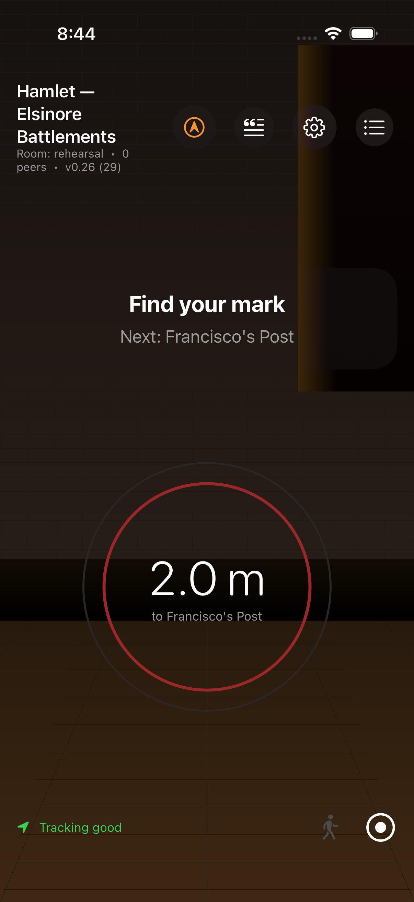
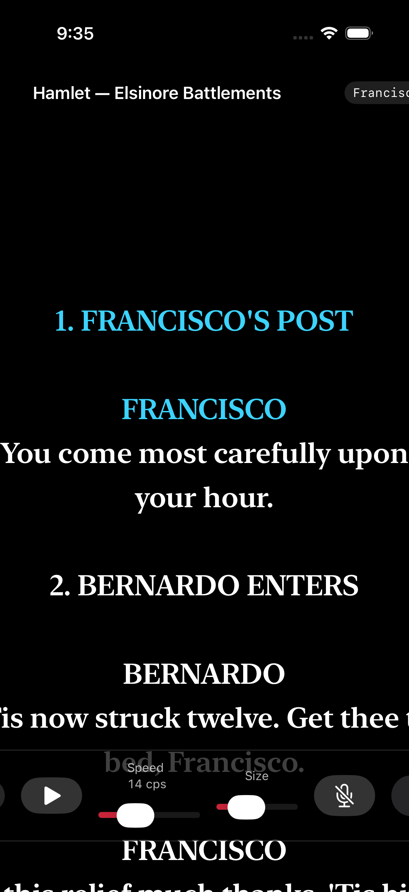
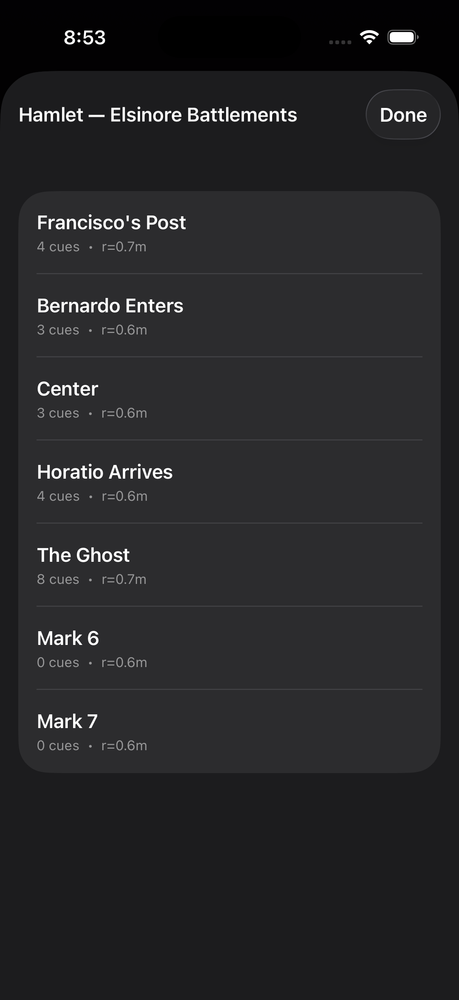
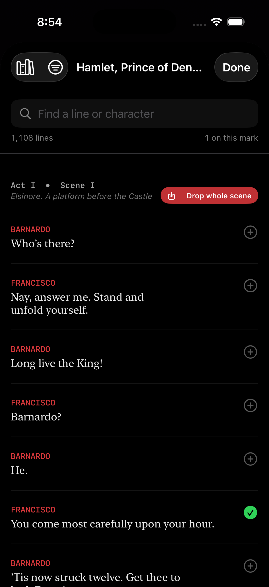
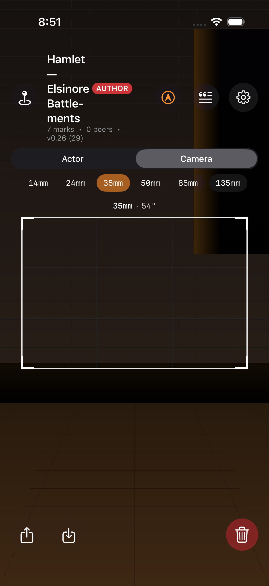

# Understudy

**Multiplayer spatial theater — and film pre-viz. A Vision Pro director, iPhones and Android performers, a Python relay for cross-platform rehearsals, and the full text of ten classic plays tappable in your pocket.**

Understudy turns a real room into a programmable stage.

A **director** wearing Apple Vision Pro places blocking marks on the floor — actual points in 3D space — and attaches lines, sound cues, light cues, and beats to each one. **Performers** hold phones that become smart teleprompters: walk onto a mark, your phone pulses, the next line appears, the sound fires, the "amber" light washes the room. The director sees every performer as a ghost avatar moving through the same virtual stage, in real time.

Record a blocking once and anyone else with a phone can *walk it back* — the app becomes a self-paced AR audio tour of your own show. Site-specific theater becomes shareable. Rehearsal becomes async. The audience can literally step into the actor's path after the curtain falls.

And because three whole Shakespeare plays are bundled in the app, you don't have to type a single line. Drop a mark at Francisco's post, open the Script Browser, tap Bernardo's "Who's there?" — it's on the mark. Tap the next line, the next.

As of v0.8, the same model serves **film directors, DPs, and location scouts**: drop virtual camera marks with real lens specs (14/24/35/50/85/135mm), see FOV wedges in the room, and use the phone as a literal viewfinder that shows what each lens would frame from each spot.


> *"Figma for stage direction."*

---

## Who this is for

| You are… | Understudy gives you… |
|----|----|
| **A theater director or stage manager** | Block scenes without a venue. Save blockings as files, share them with your cast, rehearse remotely. Fire real QLab cues over OSC. The full text of Hamlet, Macbeth, and Midsummer is tappable. |
| **A film director or DP location-scouting** | Drop virtual camera marks with real lens specs (14/24/35/50/85/135mm) and see their FOV wedges anchored in the real room. The phone is a viewfinder — see what each lens frames from each spot *before* the shoot. |
| **An architect designing a venue** | Walk sightlines and circulation paths with real bodies before construction. Mix actor marks and camera marks to rehearse a venue's cinematic use. |
| **An XR pre-viz team** | Scout spatial choreography with phones you already have, before you commit to MoCap or a game engine. |
| **An immersive experience designer** | Prototype interactive paths and cue chains in a day. Audience mode ships a finished product. |
| **A curious person on a Sunday** | Tap your floor a few times and walk a five-mark Hamlet abridgement while your phone delivers the lines. Ninety seconds. |

---

## The stack

```
┌──────────────────────────┐      MPC / LAN       ┌──────────────────────────┐
│  Apple Vision Pro        │◄────────────────────►│  iPhone                  │
│  DIRECTOR                │    (auto-Bonjour)    │  PERFORM / AUTHOR /      │
│                          │                      │  AUDIENCE                │
│  • tap to place marks    │                      │                          │
│  • edit cues & scripts   │                      │  • live AR stage         │
│  • see performer ghosts  │                      │  • tap-floor to author   │
│  • floating script pages │                      │  • camera marks +        │
│  • scrub recorded walks  │                      │    viewfinder overlay    │
│  • OSC out to QLab       │◄──WebSocket relay──►│  • shared-origin calib   │
└──────────────────────────┘         (JSON)       └──────────────────────────┘
                                       ▲
                                       │
                           ┌──────────────────────┐
                           │  Android phone       │
                           │  PERFORM / AUTHOR    │
                           │  (ARCore + OkHttp)   │
                           └──────────────────────┘
```

Apple devices on the same LAN find each other automatically over Bonjour and exchange state via **MultipeerConnectivity** — no setup, no server. When Android needs to join (or you want a remote rehearsal), spin up the Python relay on any Mac/Linux box and switch every app's Transport to **WebSocket relay**. Same wire format, same rooms, same cues.

---

## Modes — what happens when you launch

On visionOS, you're always the **Director**. On iPhone / Android, a first-launch picker asks what you're here for:

### Perform
Walk the blocking. A full-screen AR camera feed behind a dark curtain gradient shows where the marks are as glowing discs on the floor; a guidance ring shrinks as you approach the next one. Haptic pulse on entry. The next line materialises in serif type over the camera feed. System-sound SFX cues fire; screen flashes for light cues.



The flowing teleprompter scrolls the full script — voice recognition drives the cursor so your hands stay free.



### Author (iPhone + Android)
Tap the floor to drop a mark at the raycast point. Tap an existing mark to open the inline editor — name, radius, lines (with character labels), sounds, lights, holds, director notes. A **"Pick from Hamlet…"** button opens the full Shakespeare library (three plays) with search, scene filter, and already-used indicators. **"Drop whole scene"** auto-lays out a zig-zag path of marks in front of you with every line pre-populated.





In Author mode on iPhone, a segmented picker at the top switches between actor and **camera** marks. Camera marks come with lens-preset pills (14/24/35/50/85/135mm) and a **live viewfinder overlay** that shows exactly what the selected lens would frame from the phone's current viewpoint — rule-of-thirds grid, lens+HFOV chip, dimmed exterior.



Export as `.understudy` JSON (pretty-printed, hackable, identical to the wire format) via the share sheet. Import from the file picker. Autosave means edits survive relaunches.

### Audience (iPhone)
The show comes to you. Site-specific theater as a finished product: a big "Begin" card, a progress bar across the whole walk, stripped-down cue presentation (director notes hidden; light cues narrated in prose). Over the wire you're an `observer` so the director can see your position without you affecting the main cueing logic.

---

## Getting started — ninety seconds to Hamlet

1. Open `Understudy.xcodeproj` in Xcode 15.4+.
2. Pick any iOS simulator or device → **Run**.
3. First launch → pick **Perform**.
4. Allow camera permission. A five-mark Hamlet opening (Elsinore battlements) is pre-loaded: Francisco's post → Bernardo enters → center → Horatio arrives → the Ghost.
5. Walk toward the first glowing mark. When you arrive, your phone pulses, a cool-blue light cue washes the screen, and Francisco speaks.

If you have a Vision Pro, run the same scheme to a visionOS simulator — both sides find each other on Wi-Fi.

For the full multi-device flow (Apple + Android + relay), see **[QUICKSTART.md](QUICKSTART.md)**.

---

## Things to Try

1. **Launch on an iPhone simulator, pick Perform, and walk toward the first glowing disc** — your phone should pulse with haptics and "Francisco" speaks his opening line from Hamlet in serif type over the camera feed.
2. **Switch to Author mode, tap the floor three times to drop marks, then tap a mark and hit "Pick from Hamlet…"** — the full Script Browser opens; search for "Bernardo" and tap a line to attach it to the mark instantly.
3. **Tap "Drop Whole Scene" on any scene in the Script Browser** — Understudy auto-lays out a zig-zag path of marks with every line pre-populated; a 20-beat scene becomes walkable in under a second.
4. **Run the visionOS scheme to a simulator alongside the iOS scheme on a real iPhone on the same Wi-Fi** — both devices find each other over Bonjour automatically; the AVP director sees the iPhone performer as a ghost avatar moving through the virtual stage.
5. **Start the Python relay (`cd relay && python3 server.py`), switch both apps to WebSocket transport in Settings, and join from an Android device** — all three clients share the same marks and fire the same cues in sync across platforms.

---

## What's in this repo

```
Understudy/                        Swift source (iOS + visionOS, single target)
├── UnderstudyApp.swift            App entry + mode router + AR host lifecycle
├── Info.plist / .entitlements
├── Assets.xcassets/               App icon + accent color
├── Resources/
│   ├── hamlet.json                Shakespeare — 5 acts, 1108 lines
│   ├── macbeth.json               Shakespeare — 5 acts, 647 lines
│   ├── midsummer.json             Shakespeare — 5 acts, 484 lines
│   ├── seagull.json               Chekhov — 4 acts, 627 lines
│   ├── cherry-orchard.json        Chekhov — 4 acts, 643 lines
│   ├── three-sisters.json         Chekhov — 4 acts, 754 lines
│   ├── uncle_vanya.json           Chekhov — 4 acts, 525 lines
│   ├── earnest.json               Wilde — 3 acts, 873 lines
│   ├── salome.json                Wilde — 1 act, 362 lines
│   └── ghosts.json                Ibsen — 3 acts, 1123 lines
├── Models/
│   ├── CoreModels.swift           Pose, Mark, Cue, MarkKind, CameraSpec, Blocking, Performer, ID, LightColor
│   └── Version.swift              CFBundle version shown in UI
├── Shared/
│   ├── AppMode.swift              Perform / Author / Audience enum
│   ├── BlockingStore.swift        @Observable state, mark entry → cue firing
│   ├── BlockingFile.swift         .understudy FileDocument + UserDefaults autosave
│   ├── DemoBlockings.swift        The bundled Hamlet 5-mark demo
│   ├── DeviceCalibration.swift    Shared-origin transform (toBlocking / toRaw)
│   ├── ScenePlacer.swift          "Drop whole scene" layout algorithm
│   ├── Script.swift               PlayScript model + Scripts.{hamlet, macbeth, midsummer}
│   ├── WireCoding.swift           JSONEncoder/Decoder with ISO-8601 dates
│   └── Effects/
│       ├── CueFXEngine.swift      System sounds, flash state, hold countdowns, preview
│       └── OSCBridge.swift        OSC 1.0 UDP sender (QLab / TouchDesigner / Max)
├── Networking/
│   ├── Transport.swift            Protocol — swappable MPC / WebSocket
│   ├── MultipeerTransport.swift   Apple-to-Apple on LAN
│   ├── WebSocketTransport.swift   Through /relay/server.py for Android
│   └── SessionController.swift    Wires store mutations to the wire
├── iOSApp/
│   ├── PerformerView.swift        Teleprompter + SettingsSheet + FlashOverlay + PerformerARHost
│   ├── AuthorView.swift           Tap-to-place, MarkEditorSheet, drop-kind + lens pickers
│   ├── AudienceView.swift         Self-paced tour with progress bar
│   ├── ModeSelector.swift         First-launch three-card picker
│   ├── ScriptBrowser.swift        Hamlet/Macbeth/Midsummer picker → .line cues
│   ├── ARPoseProvider.swift       ARKit → Pose, applies calibration
│   ├── CalibrationButton.swift    Compass icon + menu in every mode's top bar
│   ├── ViewfinderOverlay.swift    Lens FOV framing rectangle on camera feed
│   └── AR/ARStageContainer.swift  RealityKit scene: floor-anchored marks, ghost, trail, camera rigs
└── VisionOS/
    ├── DirectorControlPanel.swift Floating window — room, transport, marks, transport strip, OSC
    ├── DirectorImmersiveView.swift RealityKit immersive stage + camera rigs + ghost + light wash
    └── MarkScriptCard.swift       Floating "manuscript page" attachment next to each mark

android/                           Android Studio project — Kotlin + Compose + ARCore + OkHttp
relay/                             Python WebSocket relay (single file, one pip dep)
scripts/                           parse_hamlet.py — Gutenberg plaintext → Resources/*.json
test-fixtures/                     Swift-generated JSON fixtures for wire-format round-tripping
Understudy.xcodeproj
PROTOCOL.md                        Authoritative wire format docs
QUICKSTART.md                      How to run the whole stack on a LAN
OSC.md                             OSC bridge output protocol (→ QLab etc.)
HANDOFF_TESTFLIGHT.md              Browser-side steps for TestFlight setup
TESTFLIGHT_COPY.md                 Drafts for App Store Connect metadata
PRIVACY.md                         Privacy policy (required by TestFlight)
```

### Architecture at a glance

- **Single Swift target** builds for iOS and visionOS. `#if os(iOS)` / `#if os(visionOS)` routes the view.
- **Models are pure value types** — `Codable`, `Sendable`, `nonisolated`. They cross actor boundaries and serialize trivially. `Mark` decodes older files without `kind` or `camera` keys, defaulting to `.actor` / `nil` — v0.1–v0.7 blockings still load unchanged in v0.8.
- **`BlockingStore` is an `@Observable` MainActor**. Mark entry enqueues `FiredCue`s into `cueQueue`; `CueFXEngine` drains the queue and actually does things (system sounds, screen flashes, visionOS stage wash, OSC out).
- **`Transport` protocol** abstracts the wire. `MultipeerTransport` for pure Apple (Bonjour `_und-stage._tcp`). `WebSocketTransport` for mixed environments including Android, via the relay. Hot-swappable at runtime from Settings.
- **`WireCoding`** is the shared `JSONEncoder`/`Decoder` with ISO-8601 dates — cross-platform safe. Kotlin's polymorphic adapter matches Swift's default Codable enum shape; `test-fixtures/` catches any drift.
- **Cue firing on transition edge** — cues fire on mark *entry*, not every frame the performer is inside the radius. No re-triggering when you wiggle.
- **Autosave on every mutation** — `addMark` / `updateMark` / `removeMark` / `addCue` / `stopRecording` / import / snapshot sync all persist to UserDefaults.
- **Shared-origin calibration** is device-local state on `PerformerARHost.shared.calibration`, not broadcast. Each device owns its own transform from raw AR frame ↔ shared blocking frame. Set via the compass button; floor-plane (yaw-only) rotation + translation.
- **Camera marks bypass the walk sequence** (`sequenceIndex: -1`) so they don't mix into the performer teleprompter flow — they're pre-viz references, not cue points.
- **OSC → QLab** is one-way UDP from any device whose `OSCBridge` is enabled. Cue firings emit `/understudy/cue/line|sfx|light|wait|note` + one `/understudy/mark/enter` per mark transition. See `OSC.md` for the protocol.

### Wire format

See [PROTOCOL.md](PROTOCOL.md). Short version: every message is a JSON `Envelope` carrying a `NetMessage` enum variant. Swift's default Codable emits enum cases as `{"caseName": {"_0": value}}` for unlabeled associated values and `{"caseName": {"label": value}}` for labeled ones — Kotlin matches with a polymorphic adapter in `android/app/src/main/java/agilelens/understudy/net/Envelope.kt`. Round-trip fixtures in `test-fixtures/` catch drift.

### Running the relay

```bash
cd relay
python3 -m venv .venv && source .venv/bin/activate
pip install -r requirements.txt
python3 server.py
# Understudy relay starting on ws://0.0.0.0:8765
```

Then in every app's Settings (gear icon) → Transport → WebSocket, enter `ws://<relay-host-lan-ip>:8765`.

---

## Roadmap

*(Latest first. Every version shipped is a real commit + push; the "Next up" list is intentional future work.)*

### Next up
- [ ] Next-mark auto-advance — right now voice auto-fire handles sub-mark cues; the performer still has to physically walk to advance marks. Optional toggle: when the last line on a mark finishes via voice AND the performer is within N seconds of walking, pre-advance the cue cursor.
- [ ] Migrate Monitoring code to AgileLensMultiplayer SPM dependency (currently copied in)
- [ ] DMX on Android — v0.24 ships iOS sACN; port `DMXOutput.swift` + `DMXCueMapping.swift` to Kotlin (`java.net.DatagramSocket`/`MulticastSocket`). Hand-roll the same E1.31-2018 packet.
- [ ] `scripts/ship-playstore.sh` — automate the `./gradlew bundleRelease` + Google Play Publisher roll-out. Guide in `HANDOFF_GOOGLE_PLAY.md`.
- [ ] Long Day's Journey into Night (O'Neill) — copyright expires; check jurisdiction before adding. Beckett's expires 2059 in Europe.

### v0.27 · First-run onboarding + teleprompter word-wrap fix

**1. Role onboarding sheets** — first time a user enters Perform, Author, or Audience mode a 3-step swipeable card sheet walks them through what to do in that role. Cards are role-specific (e.g. Performer: find your mark → follow the script → marks are on the floor). Fires once per role, remembered via `@AppStorage`. Dismiss with "Got it, let's go!"

**2. Teleprompter word-wrap fix** — text no longer clips at the left and right edges on iPhone. Root cause: `Text` inside a `GeometryReader` does not receive a correct width proposal for line-breaking. Fixed by moving `Text` into normal SwiftUI layout and using `GeometryReader` only for viewport-height measurement via `.background {}`. Also fixed controls bar overflow on portrait iPhone (Speed slider 160→100 pt, Size slider 100→80 pt).

---

### v0.26 · Stage grid, tabletop mode, rehearsal timer, props + three new plays
A batch of director-facing tools ported from the SharedCubes prototype, plus play library expansion and several finishing items from the roadmap.

**1. 9-zone stage grid** — `StageArea` enum (DS-L/DS-C/DS-R / CS-L/CS/CS-R / US-L/US-C/US-R) with world-space zone centers derived from a configurable half-width × half-depth. Director control panel "Grid" toggle shows translucent floor tiles with zone labels; "Snap" snaps newly placed marks to the nearest zone center within 0.7 m.

**2. Tabletop director view** — "Table" toggle scales the entire stage (marks, props, grid, scan ghost) to 12% at tabletop height (0.8 m high, 0.8 m in front). Director can lean over a table and review the full blocking layout without being in the room. Tap-to-place disabled in this mode to prevent accidental drops.

**3. Rehearsal timer** — compact MM:SS / HH:MM:SS strip in the director panel. Play/pause + reset. Runs on a 500 ms `Task` loop; survives window close as long as the `BlockingStore` is alive.

**4. Prop objects (set construction)** — `PropObject` model (cube/sphere/cylinder, RGB, width×height×depth, 3D pose). Props panel in the director control panel: add named props with the shape picker, resize via the inspector sheet, swipe to delete. Rendered as colored `ModelEntity` primitives in the immersive stage. Round-trips through the wire; Android ignores the new `blocking.props` field cleanly via `ignoreUnknownKeys`.

**5. Three new bundled plays** — library grows from 7 to 10:
  - *Ghosts* (Ibsen, trans. William Archer — PG #8492) — 3 acts, 1 123 dialogue lines
  - *Uncle Vanya* (Chekhov, trans. Constance Garnett — PG #1756) — 4 acts, 525 lines
  - *Salomé* (Wilde, trans. Lord Alfred Douglas — PG #42704) — 1 act, 362 lines. Parsed via HTML (`42704-h.htm`) using a known character-name set to disambiguate speaker `<p>` tags from stage direction paragraphs.

**6. Real-world camera body presets** — `CameraSpec` factory methods for 8 named bodies: ARRI Alexa 35, Alexa Mini LF, RED Monstro 8K, RED Komodo 6K, Sony Venice 2, BMPCC 6K Pro, full-frame reference, iPhone 15 Pro. Exposed as `presetGroups` in the director panel's camera picker.

**7. CSV cue sheet import** — "Import CSV" button in the director marks header. Parses `name,note` rows into marks at y=0.8 m with 0.8 m Z spacing; useful for importing a stage manager's cue sheet from a spreadsheet.

**8. Gestural scan rotation** — upgraded from v0.12's ±15° buttons to a simultaneous `DragGesture + RotateGesture3D(constrainedToAxis: .y)`. The scan ghost can now be freely rotated by pinching and twisting while dragging on visionOS 2.

**Android:** versionCode 28 → 29, versionName 0.25 → 0.26.

### v0.24 · Feature sprint #2 — five drops in parallel
Five more parallel agents, zero merge conflicts this time. The batch leans outward: two cross-platform content adds (new plays, new DMX output), two Android polish items, and the Google-Play-Console handoff doc to mirror the iOS TestFlight path.

**1. Cherry Orchard + Three Sisters** — both Chekhov plays from Project Gutenberg ebook #7986 (Julius West translation, PD). `parse_modern.py` handled both unchanged; `three-sisters.json` is 224 KB / 754 lines, `cherry-orchard.json` 182 KB / 643 lines. Registered in iOS `Scripts.all` + Android `Scripts.kt`. Seven plays now bundled (Hamlet, Macbeth, Midsummer, Seagull, Earnest, Cherry Orchard, Three Sisters).

**2. Real SFX WAV bundle on Android** — replaces v0.23's `ToneGenerator` placeholders with five CC0 WAVs synthesized via `ffmpeg lavfi` filters (bell 52 KB, chime 65 KB, knock 11 KB, thunder 108 KB, applause 86 KB — 328 KB total). `cuefx/CueAudioPlayer.kt` rewritten to `SoundPool` first with `ToneGenerator` fallback for unknown cue names. APK stays at 19.7 MB. New `LICENSE-SOUNDS.md` documents provenance (all self-generated, CC0).

**3. Audience-mode flash overlay + next-mark auto-advance** — finishes v0.23's loose end (`AudienceScreen` now renders `FlashOverlay` + HOLD badge matching `PerformerScreen`). Adds a new Teleprompter-section pref "Auto-advance to next mark" (default off): when on, crossing the last `Cue.Line` on a mark via voice recognition pre-advances `currentMarkID` to the next mark in sequence so the teleprompter scrolls and the next mark's cues are ready for voice-fire without waiting on proximity. Five guard conditions (pref on, voice active, last Line cue, still on mark, next mark exists) — never wraps past end of show.

**4. DMX direct output (iOS + visionOS)** — sACN (E1.31) over UDP, parallel to the existing OSC output layer. `Understudy/Shared/Effects/DMXOutput.swift` hand-rolls the full E1.31-2018 packet (root → framing → DMP), uses `NWConnection` over UDP port 5568, supports multicast (`239.255.{universe>>8}.{universe&0xFF}`) and unicast. `Understudy/Shared/Effects/DMXCueMapping.swift` ships a default 4-fixture RGBW+dim preset at DMX addresses 1/6/11/16. New Settings section in the iOS PerformerView: enable toggle, universe, destination picker, node IP, "send test wash" button. Prefs survive app restart via `UserDefaults`. No deps — Network.framework only.

**5. HANDOFF_GOOGLE_PLAY.md + GOOGLE_PLAY_COPY.md** — the Android/Play-Console analogue to `HANDOFF_TESTFLIGHT.md`. 374 lines covering keystore creation, `build.gradle.kts` signingConfig via env vars, `./gradlew bundleRelease`, Play Console app-record setup (bundle ID + default language + privacy policy URL + data-safety form — all cross-referenced to `PRIVACY.md`), Internal Testing track, Play App Signing, and 11 gotchas (signing leaks, minSdk, targetSdk rolling deadline, versionCode monotonicity, .aab vs .apk, 150 MB size, opt-in URL scope, ARCore filter, etc.). Recommends Gradle Play Publisher plugin for the eventual `scripts/ship-playstore.sh`.

### v0.23 · Android parity sprint — five features in one drop
Closes the long tail of Android-vs-iOS gaps with five features built in parallel by isolated agents on worktree branches, then sequentially merged. All five build clean and the 6 WireCompatTests still pass.

**1. Audience mode** — third-card choice in the mode picker alongside Performer and Author. Renders the AR stage + current-mark card + next-line preview + progress ("Mark 3 of 12"). Auto-advances when you walk into the next mark's radius (proximity alone, no wall-clock). iOS already had it; Android was the hold-out.
- New `ui/AudienceScreen.kt`, `AppMode.AUDIENCE` enum case, third `ModePill` in Settings, third `ModeCard` in the mode picker.

**2. Floating script panels** — visionOS-style world-anchored cards. The next line shows as a translucent card floating above the mark you're walking toward, projected to screen-space using the same view×projection matrices the mark-disc overlay already caches. Typography mirrors the teleprompter (character in uppercase StageRed monospace, line in serif white, mark name dimmed). Toggled by a new "Floating script panels" Display pref; performer mode only, AR stage only.
- New `ui/ScriptPanelOverlay.kt`. `ArStageView` gains `showFloatingScript: Boolean = false` param; `SettingsState` + `PrefsRepo` gain `showFloatingScript`.

**3. ARCore Depth pass-through** — colored per-pixel depth overlay (warm = near, cool = far, no-data = transparent). Android's analogue to the iOS LiDAR mesh visualization. Gated on `session.isDepthModeSupported(AUTOMATIC)` so devices without depth silently render nothing.
- New `ar/DepthRenderer.kt`. `ArPoseProvider` now configures `DepthMode.AUTOMATIC`. New "Depth overlay" Display pref.

**4. Camera marks + viewfinder (film director mode)** — Android now gets the UI for the camera-mark data model that shipped back in v0.20. The mark editor has an Actor/Camera toggle revealing a `CameraSpec` form (focal-length chips for 14/24/35/50/85/135mm + freeform, sensor picker, tripod-height and tilt sliders). The AR stage draws a cyan FOV wedge on the floor for every camera mark; standing on a camera mark overlays a rectangular viewfinder cutout matching that lens/sensor over the live AR feed (with corner ticks + rule-of-thirds + lens chip "35mm · 54°").
- New `model/CameraSpecHelpers.kt` (FOV extension props + `LensPresets` + `SensorPresets`, all outside `CoreModels.kt` to keep the wire format sacred). New `ui/ViewfinderOverlay.kt`. `ArStageView` tints camera discs cyan and draws wedges. `MarkEditor` gains the Camera form.

**5. CueFXEngine firing** — the scroll-only port from v0.17 is now the full engine. Walk onto a mark → audio + flash + hold cues fire locally, voice-recognized spoken lines auto-fire matching cues (reusing the v0.17 `SpeechRecognizer`). Replaces the `isAutoFire = false` hardcode in `TeleprompterScreen`.
- New `cuefx/CueFXEngine.kt` (attaches to store's cue queue, exposes `flashState`/`holdState`/`lastAutoFireBatch` StateFlows), `cuefx/CueAudioPlayer.kt` (ToneGenerator-based bursts — SFX catalog swap-in path is documented: drop WAVs into `res/raw/` and swap in `SoundPool`), `cuefx/FlashOverlay.kt` (full-screen Compose wash). `BlockingStore` gains `FiredCue` + `cueQueue` + `enqueueCuesForMark`. The engine lives on `UnderstudyApp` so it survives config changes. Remote `NetMessage.CueFired` envelopes now fire the engine locally.

The iOS/visionOS side keeps its CueFXEngine unchanged — wire format is untouched, so an iPhone, Apple Vision Pro, and Android phone all see the same fire events when a performer crosses a mark.

### v0.22 · Android tap-to-place on the AR stage
Closes the last v0.21 Author-mode parity gap with iOS/visionOS. On iPhone, an author can aim the live AR view at any point in the room and tap the floor to place a mark there. Before v0.22 an Android author could only drop marks at the performer's *current* position, which meant walking to every intended mark. Now the floor tap does the walking for you.

- **`ui/ArStageView.kt`** — gains an optional `onFloorTap: (worldX, worldZ) -> Unit` parameter. A Compose `Modifier.pointerInput { detectTapGestures { ... } }` layer sits on top of the GL surface but **below** the app chrome, so mark rows, "Drop mark here", and the toolbar still consume taps normally; only taps that miss the UI reach the AR floor layer.
- **`rayHitFloor()` helper** — unprojects the tap through the cached `view * projection` matrix, intersects the resulting world-space ray with the `y = 0` stage floor plane, and returns `(x, z)` or `null` (parallel / behind-camera / &gt; 50 m away — degenerate cases get rejected). Uses the 10 Hz matrices `ArPoseProvider` already captures for the mark-disc overlay, so no GL-thread shenanigans required.
- **`AuthorScreen`** — new `arProvider`, `showArStage`, and `onDropMarkAt` parameters. When AR is on the live camera feed renders behind the mark list; the empty-state placeholder text flips to *"Tap the AR stage to place a mark on the floor, or tap 'Drop mark here' to place at your current position."*
- **`MainActivity`** — `onDropMarkAt(x, z)` builds a `Mark` at `(x, 0, z)` with yaw inherited from the performer's current pose, sequence-index-auto-incremented, broadcasts via `transport.send(NetMessage.MarkAdded(...))`, and opens the mark editor on the new mark — matching the flow for `onDropMarkHere`.

Same JSON wire format as before; a floor-tapped mark from Android is indistinguishable from one tapped on iPhone or placed by a visionOS director.

### v0.21 · Android Script Browser + Drop Whole Scene
Android Author mode grows the full script-picker UX that iOS + visionOS have had since v0.4/v0.5. A stage manager handed an Android phone can now tap Bernardo's "Who's there?" out of Hamlet just like they can on iPhone. One-tap Drop Whole Scene auto-lays out a zig-zag walk of marks with dialogue pre-populated.

- **5 plays bundled as Android assets** — `hamlet.json`, `macbeth.json`, `midsummer.json`, `seagull.json`, `earnest.json` copied byte-for-byte from `Understudy/Resources/` into `android/app/src/main/assets/`. Total ~1 MB. Loaded lazily + cached via `Scripts.load(context, assetName)`.
- **`teleprompter/PlayScript.kt`** — Kotlin mirror of Swift's `PlayScript`. Same `Act → Scene → Entry` shape, same `LocatedLine` flat-list helper, same case-insensitive `linesMatching(query)` filter. Custom `EntrySerializer` matches the `{"kind": "line"|"stage", …}` JSON shape.
- **`teleprompter/Scripts.kt`** — lazy loader + cache, `PlayRef` list.
- **`teleprompter/ScenePlacer.kt`** — Kotlin port of Swift's layout algorithm. Same beat bucketing (one beat per speaker turn, max 4 lines/beat, stage directions on as `.note` cues), same zig-zag geometry (1.2m forward spacing, 0.8m lateral offset alternating sides, yaw toward the next beat).
- **`ui/ScriptBrowser.kt`** — Compose dialog mirroring iOS's. Top bar with play-picker menu + scene-filter menu, search field, 3-color karaoke-style line list (character label uppercase monospace red, line body serif white), green check when a line is already on the current mark, "Drop scene" chip on every scene header with a confirmation dialog showing the expected mark count.
- **`ui/MarkEditor.kt`** — new purple "Pick from script…" button above the custom-line fields. Opens the Script Browser with the current mark pre-selected; drops from the browser commit to the mark via `onChange` (line toggles) or spawn multiple new marks via `onMarksDrop` (Drop Whole Scene).

Same wire format as iOS end-to-end — an Android author dropping Act I Scene I of Hamlet via "Drop whole scene" produces JSON that iOS/visionOS peers can render and walk without distinction from a blocking authored on an iPhone.

### v0.20 · Android wire compat — Mark.kind, CameraSpec, Blocking.roomScan
Closes a silent-data-loss path: iOS/visionOS were ahead of Android by two schema revisions Android was dropping on decode.

- **`MarkKind` enum** + **`CameraSpec` data class** in `android/.../model/CoreModels.kt` — mirrors Swift's `MarkKind` (`actor` / `camera`) and `CameraSpec` (focal length, sensor dims, tripod height, tilt). `Mark` gains `kind: MarkKind = actor` + `camera: CameraSpec? = null` with defaults that decode older files unchanged.
- **`RoomScan` data class** — same shape as Swift's: `positionsBase64`, `indicesBase64`, ISO-8601 `capturedAt`, name, `overlayOffset`. `Blocking` gains `roomScan: RoomScan? = null`. Android doesn't render the mesh yet (no ARCore wireframe ghost pipeline) but **round-trips it through decode + encode** so a scouted-room scan survives re-broadcast through an Android device in a mixed session.
- **`TeleprompterDocument.kt`** now filters by `kind == actor` matching Swift — camera marks don't pollute the performer teleprompter flow.
- **`WireCompatTest` unit tests** — new `app/src/test/java/.../WireCompatTest.kt` with 6 tests: every Swift-generated fixture under `/test-fixtures/` round-trips through the Kotlin decoder; v0.8 camera-mark + v0.9 room-scan encode/decode cleanly; legacy (pre-v0.8 / pre-v0.9) JSON without the new keys still parses. Added `junit:4.13.2` as the only test dependency. `./gradlew :app:testDebugUnitTest` runs in ~4s. **6 tests, 0 failures** as of this commit.

Platform drift is now a failing test, not a runtime silent-data-loss during a real rehearsal.

### v0.19 · TestFlight distribution pipeline
Everything scriptable is scripted. The browser steps that App Store Connect requires a human to click through are documented in `HANDOFF_TESTFLIGHT.md`.

- **`scripts/ship-testflight.sh`** — archive Release config → export `.ipa` with App Store distribution signing → upload via `xcrun altool --upload-app` using an App Store Connect API key. One command per platform: `scripts/ship-testflight.sh` (iOS) or `scripts/ship-testflight.sh --platform visionos`. `--dry-run` archives + exports without uploading.
- **`scripts/bump-version.sh`** — single-command version bump across iOS + visionOS (`project.pbxproj`) AND Android (`build.gradle.kts` — `versionCode`, `versionName`, `APP_VERSION`, `APP_BUILD`). Default bumps build only; `--marketing X.Y` bumps marketing version too. Kills the "edit 7 places" chore I've been doing manually every ship.
- **`HANDOFF_TESTFLIGHT.md`** — exact browser steps for (1) creating the App Store Connect record with iOS + visionOS support, (2) generating an API key + stashing it under `~/.appstoreconnect/private_keys/`, (3) Export Compliance + Beta App Information + Internal Testers under the TestFlight tab. Every gotcha I've hit before is listed inline.
- **`TESTFLIGHT_COPY.md`** — draft app subtitle, beta description, "what to test" notes, screenshot checklist, 60-second App Preview shot suggestion.
- **`PRIVACY.md`** — required by App Store Connect. Documents what data the app touches (on-device AR + speech, peer-broadcast pose + blocking, optional OSC / Mission Control out) and explicitly what we don't do (no analytics, no accounts, no crash reporters, no server-side storage).
- Everything in this commit leaves Understudy at **v0.19 (20)** and ready to run `scripts/ship-testflight.sh` the moment the App Store Connect record + API key are in place.

### v0.18 · Google AI Glasses companion — teleprompter on your face
Android phone stays the controller (voice recognition, auto-scroll, controls); the paired Android XR AI Glasses show a pixel-tight 480×480 teleprompter canvas at the bottom of your left eye. Pattern borrowed directly from Alex's Gemini-Live-ToDo `TeleprompterControlActivity` + `TeleprompterActivity` — same APK, two `ComponentActivity`s, shared state via a Kotlin `object` singleton.

- **`glasses/GlassesTeleprompterState.kt`** — `object` with `mutableStateOf` for `renderMode` (SINGLE_LINE / FLOWING_SCRIPT), `document`, `scrollProgress`, `currentMark`, `lastFlashAt`, `lastFlashColor`. Both activities in the same process; Compose on either side re-renders when fields change. No IPC needed.
- **`glasses/GlassesTeleprompterRenderer.kt`** — 480dp-sized composable with two modes:
  - **SINGLE_LINE** — just the current mark's first Line cue at screen center, big serif, character label above in uppercase red. Ideal "prompter for AR glasses" — maximum legibility, minimum distraction.
  - **FLOWING_SCRIPT** — karaoke scroll of the flattened `TeleprompterDocument` with the same 30-char cyan active window that the phone uses. Pocket teleprompter.
- **`glasses/GlassesTeleprompterActivity.kt`** — `ComponentActivity` hosts the renderer, adds `FLAG_KEEP_SCREEN_ON + FLAG_SHOW_WHEN_LOCKED + FLAG_TURN_SCREEN_ON`. Manifest entry has `android:requiredDisplayCategory="xr_projected"` + the `CATEGORY_PROJECTED` intent-filter so Android routes it to the glasses display.
- **`glasses/GlassesLauncher.kt`** — the phone→glasses launch pattern. `ProjectedContext.createProjectedDeviceContext(activity)` → `createProjectedActivityOptions(...).toBundle()` → `startActivity(intent, bundle)`. Gated by `Build.VERSION.SDK_INT >= VanillaIceCream` (API 35).
- **Phone-side integration in `TeleprompterScreen.kt`** — new `glassesConnectedState()` collects `ProjectedContext.isProjectedDeviceConnected` as Compose state (API 36+). When glasses are paired, a green 👁 button lights up in the teleprompter controls to launch onto the glasses; a tiny "line"/"scroll" text button cycles the render mode. Phone-side state is mirrored into `GlassesTeleprompterState` via `LaunchedEffect`s keyed on `scrollProgress` and `document`.
- **Manifest + gradle updates** — added `androidx.xr.projected:projected:1.0.0-alpha03`, bumped AGP 8.5.2 → 8.9.1 and Kotlin 1.9.22 → 2.0.21 (required by the XR dep), moved Compose compiler config from `composeOptions.kotlinCompilerExtensionVersion = "1.5.8"` to the new `org.jetbrains.kotlin.plugin.compose` Gradle plugin, Gradle wrapper 8.9 → 8.11.1.

Not yet: wiring the glasses render onto a physical device (I don't have AI Glasses here to verify). Code compiles cleanly with all the XR APIs wired; runtime exercise is the next user-facing step.

### v0.17 · Android teleprompter + voice mode (scroll only)
Android catches up with iOS v0.13's teleprompter. Voice matching algorithm is literally the Kotlin original Alex wrote (from Gemini-Live-ToDo `TeleprompterControlActivity.processSpokenText`) — I re-ported it to stay in sync with the Swift side.

- **`teleprompter/TeleprompterDocument.kt`** — Kotlin mirror of Swift's. Same output: flattened script with per-mark character offsets + per-line-cue `endOffset` markers. Android's `Mark` doesn't yet have `kind` (v0.8 film-mode types aren't ported), so every `sequenceIndex >= 0` mark is included — identical behavior for a theater-only blocking.
- **`teleprompter/VoiceMatcher.kt`** — 1:1 port of Swift's VoiceMatcher. Same algorithm: last 1-3 spoken words, 50-char forward window, jump to end-of-match, forward-only.
- **`teleprompter/SpeechRecognitionDriver.kt`** — `SpeechRecognizer` with partial results + auto-restart on `onResults` / `onError` for continuous listening. Same trick your Gemini Live teleprompter uses. `EXTRA_PREFER_OFFLINE` = on-device where available.
- **`teleprompter/TeleprompterScreen.kt`** — full-screen Compose `Dialog` with the same 4-scroll-input model (manual drag, auto-scroll timer, voice match, mark-follow). Karaoke rendering with `AnnotatedString` + `SpanStyle` — past 35% gray, 30-char cyan active window, white future.
- **📜 teleprompter button** added to the top bars of PerformerScreen + AuthorScreen on Android (document icon).
- **RECORD_AUDIO permission** added to AndroidManifest; runtime request on voice-mode toggle.
- **Auto-fire is voice-scroll-only for now.** Android doesn't yet have a CueFXEngine equivalent (no cue queue, no audio flash overlays). The `isAutoFire` toggle is a stub; v0.18+ will port the engine.

### v0.16 · QR-code calibration — precise shared origin in one glance
Upgrades v0.7's "stand at stage center, face upstage, tap compass at the same time" manual ceremony. A printed or on-screen QR target becomes the shared anchor; performer phones auto-calibrate the moment they see it.

- **`QRCalibration`** — `generateQR(payload:pixelSize:)` renders a QR via `CIFilter.qrCodeGenerator`. `buildDetectionImageSet()` wraps the fixed `understudy://calibrate` payload as an `ARReferenceImage` at 210 mm physical width. `calibration(from: simd_float4x4)` converts the detected image's world transform into a `DeviceCalibration` (yaw derived from the image's +X axis, position from column 3). Manual ceremony still works as fallback.
- **`ARPoseProvider.session(_:didAdd:)` + `didUpdate:`** — ARKit callback fires when the reference image comes into view; writes the derived `DeviceCalibration` into `PerformerARHost.shared.calibration` directly. Performers don't tap anything.
- **`ARWorldTrackingConfiguration.detectionImages`** wired on session start in `ARStageContainer.makeUIView`, so image tracking is always on. Zero runtime overhead when no target is visible.
- **`QRCalibrationView`** — cross-platform SwiftUI. On iPhone: opens from Settings → "Show QR for performers to scan" as a bright-white sheet (ramps screen brightness to max for detection reliability). On visionOS: a dedicated `WindowGroup(id: "QRTarget")` opened from the director panel's "QR Target" button; can be pinned anywhere in the director's space.
- One fixed target for the whole fleet — payload is `understudy://calibrate`, no per-room state. If you need to distinguish rehearsal rooms, use different room codes in Settings (that's already how MPC / WebSocket / Mission Control identify sessions).

### v0.15 · Live scan visualization on iPhone
You're walking with Scan Room on, the triangle counter ticks up, but the screen shows you nothing — v0.14 and earlier only visualized the mesh on visionOS. Fixed.

- **Live mesh rendering during capture.** `ARStageContainer.syncMeshAnchors()` iterates `ARSession.currentFrame.anchors`, filters to `ARMeshAnchor`, and mirrors each one as a translucent cyan `ModelEntity` in the ARView scene. Rebuilds only when the anchor's vertex or face count has changed (ARKit's "the geometry is newer" signal), not every frame. Handles both 16-bit and 32-bit index formats.
- **Saved-scan fallback.** When no live mesh anchors are present (e.g. fresh session after relaunch) but the blocking has a saved `roomScan`, `syncSavedScan` mounts the stored mesh as the ghost so yesterday's scan is still visible today. Auto-hides when live anchors return, so we never double-render the same geometry.
- **Positions live in ARKit world frame** — calibration transform intentionally NOT applied to mesh anchors (they and the camera pose share the same origin). Marks still go through `toRaw()` as before.

### v0.14 · The show runs itself — voice-driven cue firing
v0.13 shipped a voice-following teleprompter; v0.14 closes the real loop. When the actor finishes speaking a line, the mark's subsequent SFX / light / wait cues fire automatically. No stage manager. No OSC GO. No taps.

- **Per-line-cue character ranges** — `TeleprompterDocument` now tracks every `.line` cue's `(markID, cueID, endOffset)` in the flowing script text. `linesFinishedBetween(oldProgress:newProgress:)` returns the line markers that fall strictly inside a voice-induced jump.
- **`CueFXEngine.voiceLineFinished(cueID:on:)`** — given a line that just ended, fires every subsequent non-line cue on that mark (SFX, light, wait) up to the next line or end of mark. Pulls from the same `cueQueue` path as a real walk-on so the teleprompter, outbound OSC, and Mission Control all see the cues identically. `voiceFiredCueIDs: Set<ID>` prevents double-fires if voice scroll bounces.
- **Auto-fire toggle** — a 🔥 flame button appears next to 🎤 in the teleprompter controls. Enabled by default when voice mode is on; disable to get voice-scroll-only behavior. Flame is orange when hot, grey when cold.
- **"🔥 3 cues fired" flash** — a 2-second pill appears above the controls whenever auto-fire lands, so you can see exactly when and how many things fired.
- **Reset clears the fired-set** — the back-to-top button also calls `resetVoiceFiredCues()`, so re-reading the scene from the top fires everything again.

The demo: walk to the Ghost's mark, open the teleprompter (📜), turn on voice (🎤) and auto-fire (🔥), say *"Look where it comes again"* — thunder, blue light, beat, blackout — all automatic, all driven off what you said.

### v0.13 · Teleprompter with voice-driven karaoke scroll
Inspired by Alex's Gemini-Live-ToDo AI Glasses teleprompter (the `processSpokenText` algorithm in `TeleprompterControlActivity.kt`). Before today the teleprompter was per-mark cue cards; now there's a unified full-script view that scrolls four ways.

- **`TeleprompterDocument`** — flattens a Blocking into one flowing script with per-mark character offsets. Only actor marks with sequenceIndex ≥ 0 (camera/freeform marks stay out). Dialogue ranges are tracked separately so voice matching can search only spoken text.
- **`TeleprompterView`** — cross-platform SwiftUI. Karaoke rendering: past text is 35%-gray, a 30-char active window is cyan, future is white. Serif body, configurable 18-56pt size, rule-of-thirds vertical anchoring so the active text sits high in the viewport.
- **Four scroll inputs** contend for `scrollProgress`:
  1. **Manual drag** — any vertical gesture
  2. **Auto-scroll** — timer at a user-set chars-per-second rate (default 14cps ≈ theatrical pace)
  3. **Voice mode** — on-device `SFSpeechRecognizer` (iOS + visionOS); each partial result calls `VoiceMatcher.nextProgress` which takes the last 1-3 spoken words and substring-matches inside a 50-char forward window from the cursor. Only ever moves forward. On-device only (`requiresOnDeviceRecognition = true`) so lines never leave the device.
  4. **Mark follow** — when the local performer walks onto a new mark, the teleprompter snaps to that mark's header offset, unless the user manually dragged within the last 3 seconds (polite deference).
- **`VoiceMatcher.nextProgress`** — direct port of Alex's Kotlin algorithm to Swift; tolerant of re-reads, pauses, and the recognizer's rolling partial results.
- **Entry points** — a 📜 button in every iPhone mode's top bar (Perform / Author / Audience) opens it as a `fullScreenCover`. On visionOS, a "Teleprompter" button on the director panel opens it as a floating window the director can position anywhere. Same view, same state.
- **Permissions** — Info.plist + project.pbxproj now carry `NSMicrophoneUsageDescription` and `NSSpeechRecognitionUsageDescription`. First-time voice toggle prompts the system dialog; subsequent sessions skip it.
- **Heard indicator** — a small "heard: …" caption at the bottom of the teleprompter shows the last 64 chars of recognized speech, so you can see what the recognizer's actually matching on.

### v0.12 · Align the scouted room to the rehearsal room
Completes the v0.9 LiDAR story. The scan was capturable and visible, but not alignable — so if your Brooklyn rehearsal studio and your scouted Manhattan loft weren't already sharing a coordinate frame (and they never are), the ghost floated in the wrong place.

- **Draggable ghost on visionOS.** The scan entity gets a coarse bounding-box `CollisionComponent` (cheap — derived from vertex bounds, not per-triangle) and an `InputTargetComponent`. A `DragGesture.targetedToAnyEntity()` translates the ghost on the floor plane when the alignment lock is open. Y is pinned so the floor stays aligned with the real floor.
- **Rotation via buttons.** visionOS 1.0 has no `RotateGesture3D`, so rotation is two buttons in the director panel's new "Scan align" strip — ±15° increments. (Gestural rotation is a v2.0-target item.)
- **Lock by default.** `BlockingStore.scanAlignmentLocked` gates drag + buttons so the ghost doesn't drift mid-rehearsal from an accidental tap. Toggle off ("Align") to enter edit mode.
- **Reset** button clears any drift back to scan origin.
- **Live broadcast.** Every committed move emits `roomScanOverlay(Pose)` over the wire (message case shipped in v0.9) so every peer's ghost re-renders in the new pose without re-transmitting the mesh. Autosave on each commit.
- Align strip in the director panel shows the scan's name, triangle count, and current offset ("`+0.85m, +45°`") so you can see what you're doing.

### v0.11 · Two more bundled plays (Chekhov + Wilde)
- **New `scripts/parse_modern.py`** — handles the 19th/early-20th-century format that Shakespeare's parser chokes on (speaker-inline dialogue, unnumbered scenes, "FIRST ACT" vs. "ACT I"). Lenient ACT/SCENE regexes, two speaker shapes (`CHARACTER.` own-line like Wilde vs. `CHARACTER. dialogue` inline like Chekhov), and a tightened table-of-contents skip heuristic (no other ACT within 50 lines + at least one speaker shape within 80).
- **The Seagull** (Chekhov, Gutenberg #1754 — Garnett translation) — 4 acts, 627 lines of dialogue. `Resources/seagull.json`.
- **The Importance of Being Earnest** (Wilde, Gutenberg #844) — 3 acts, 873 lines, 43 stage directions. `Resources/earnest.json`.
- Script Browser automatically picks both up via `Scripts.all`. The library now covers five bundled plays — Hamlet, Macbeth, Midsummer, Seagull, Earnest — across two parsers and three authors.

### v0.10 · Bidirectional OSC — QLab can GO the show
- **Inbound OSC receiver.** `OSCReceiver` listens on UDP 53001 (default) for `/understudy/go`, `/understudy/back`, `/understudy/reset`, `/understudy/mark <seq:int>`. Enable from Settings → Stage Manager on iPhone or the OSC sheet on visionOS.
- **`/go` fires the next mark's cues.** Same path as a real walk-on: cues enqueue into `cueQueue`, the teleprompter shows the line, SFX plays, light flashes, and **the outbound OSC stream mirrors it right back** — so QLab's GO (bound to the space bar via a Network cue at `<device>:53001/understudy/go`) advances Understudy AND QLab's show cues fire in lock-step via the outbound `/understudy/cue/*` echo.
- **Manual GO on the director panel.** Red "GO" button (keyboard shortcut: Return) + amber back-step, for when there's no QLab in the room and the director is stage-managing themselves.
- `CueFXEngine` tracks a `goCursor` independent of performer movement — so cues advance at the SM's pace even when performers are ahead or behind.
- See [OSC.md](OSC.md) for the full inbound + outbound protocol.

### v0.9 · LiDAR room capture + Mission Control fleet visibility
- **LiDAR scan on iPhone Pro.** `MeshCapture` turns on `ARWorldTrackingConfiguration.sceneReconstruction = .mesh` on the shared ARKit session, polls mesh anchors as the user walks, and on "Finish" flattens every `ARMeshAnchor` into a single world-space mesh. "Scan room" button appears automatically in Author mode on LiDAR-capable devices (iPhone 12 Pro+, iPad Pro). Progress strip shows live triangle count during capture.
- **`RoomScan` wire type** — positions (Float32 big-endian) + indices (UInt32 big-endian), base64-wrapped inside the existing JSON envelope. `Blocking.roomScan` is optional so older files still load. Two new `NetMessage` cases: `roomScanUpdated(RoomScan?)` (nil clears) and `roomScanOverlay(Pose)` (move/rotate the scan without re-transmitting the mesh — so a scouted Manhattan loft can be aligned to a Brooklyn rehearsal studio).
- **visionOS renders scan as wireframe ghost** — `RoomScanMesh` builds a RealityKit `MeshResource` from the scan and hangs it off the stage root as a translucent cyan "architectural drawing" material. The director stands in their actual office and sees the scouted location superimposed on their real room. Marks live in the scan's coordinate system, so tripod placements already reflect where they'd sit on location.
- **Mission Control integration** — Understudy now advertises `_agilelens-mon._tcp` over Bonjour alongside its MPC / WebSocket transports, using the same `MonitoringBroadcaster` / `MonitoringEvent` schema that WhoAmI, LaserTag, and SharedScanner use (copied from `AgileLensMultiplayer` SPM; migration to a proper dep is a v1.0 item). Fleet-wide Mission Control observers pick up live pose updates, player joins/leaves, room scan mesh chunks, and heartbeats — Understudy shows up in the 2D / 3D / heatmap / character views automatically.
- **Registered with Dev Control Center** at `http://sam:3333` with `id=understudy`, `bundle_id=agilelens.Understudy`, color `#C7232D` — fleet build dashboard tracks every push.

### v0.8 · Film mode — camera marks + virtual viewfinder
- **Two kinds of marks**: `MarkKind.actor` (the existing behavior) and `MarkKind.camera`. Both placed via the same tap-to-drop gesture in Author mode; a segmented picker + lens-preset pills at the top of the screen choose what you're dropping.
- **`CameraSpec`** — focal length, sensor size, tripod height, tilt. Six presets out of the box (14/24/35/50/85/135mm on full-frame). Derived horizontal + vertical FOV.
- **Virtual viewfinder overlay** — when dropping a camera mark, a framing rectangle appears live on the AR camera feed showing exactly what the selected lens would capture from the phone's current viewpoint. Rule-of-thirds grid, lens+HFOV chip, dimmed exterior. Cycle through lens presets to see each framing instantly.
- **Camera marks render as virtual tripods** on both iPhone (AR stage) and visionOS (immersive stage): amber disc, tripod rod, camera body at the specified height with the specified tilt, translucent amber FOV wedge spreading 3 m from the lens. A director in AVP walks through the room and sees 4 camera positions with their frustums at once — 3D shot list in midair.
- **Full backward compatibility** with v0.1–v0.7 `.understudy` files.

### v0.7 · Shared-origin calibration
- **Multiplayer actually works in a real room.** Each device's ARKit / ARCore session starts with its own world origin; `Mark(1.2, 0, -0.5)` lived in a different physical spot on every phone without calibration.
- **`DeviceCalibration`** — floor-plane (yaw-only) transform with `toBlocking(_:)` / `toRaw(_:)`.
- **Ceremony**: everyone stands at agreed-upon stage center, faces upstage, and taps the compass in the top bar at the same time. Every mark placed on any phone now lands at the same real-world spot on every other phone.
- Compass is green + filled when calibrated (with "N seconds ago" footer); amber outline when not.

### v0.6 · QLab bridge + more plays
- **OSC → QLab / show control** — `OSCBridge` (pure Swift, no deps) sends `/understudy/cue/line`, `/understudy/cue/sfx`, `/understudy/cue/light`, `/understudy/cue/wait`, `/understudy/cue/note`, and `/understudy/mark/enter` over UDP when cues fire. See [OSC.md](OSC.md).
- **Three bundled plays** — Hamlet, Macbeth, A Midsummer Night's Dream in the Script Browser's play picker.

### v0.5 · Drop a whole scene, preview a cue, script-in-space, Android catches up
- **Drop Whole Scene** — one-tap in the Script Browser auto-lays out a zig-zag path of marks with dialogue bucketed by speaker (max 4 lines per beat). A 20-beat scene becomes a walkable blocking in under a second.
- **Floating script panels on visionOS** — every mark in the immersive stage gets a translucent "manuscript page" floating at shoulder height nearby. Script-in-space.
- **Cue preview** — ▷ next to every cue in the mark editor. Tap to fire immediately.
- **Android Author mode + live AR background** — mode picker, drop-mark button, inline editor, export/import, ARCore camera feed replaces the radar by default.

### v0.4 · The script
- **Full Hamlet bundled** — parsed from Project Gutenberg #1524. `Resources/hamlet.json` (~330 KB).
- **Script Browser** in Author mode — tap a line, it's on the mark. Search by character or word; scene filter menu; already-used green check.
- **Structured `PlayScript` model** — open to more plays via `Scripts.all`; see `scripts/parse_hamlet.py`.

### v0.3 · iPhone goes solo
- **Three iPhone modes** — Perform, Author, Audience. First-launch picker, switchable from Settings.
- **Author mode** — tap the floor to drop marks; tap a mark to open the inline editor (line / sfx / light / wait / note) without an AVP.
- **Audience mode** — self-paced walk through a finished blocking; hides director notes; progress bar.
- **Save / load `.understudy` blockings** — fileExporter + fileImporter; pretty-printed JSON identical to the wire format.
- **Autosave** to UserDefaults on every mutation.
- **Bundled Hamlet 5-mark demo** pre-loaded on first launch.

### v0.2 · Theater that fires + Android
- iPhone AR stage view — live camera with floor-anchored marks.
- Playback ghost — replay recorded walks as translucent AR avatars.
- SFX cues play system sounds; light cues flash phones and tint the immersive visionOS stage.
- **Android performer** — ARCore world tracking + OkHttp WebSocket.
- **WebSocket relay** — Python server, room-scoped broadcast.

### v0.1 · Foundation
- iOS performer (ARKit + haptics + teleprompter).
- visionOS director (RealityKit + tap-to-place + sequence ribbon).
- Multipeer sync of marks and performer positions.
- Cue editor (lines, notes).
- Walk recording (stored on `Blocking` as `reference`).

---

## Project rules

- The version number is shown in every top bar (`AppVersion.formatted`) and must match `MARKETING_VERSION` + `CURRENT_PROJECT_VERSION` in `project.pbxproj` (and `versionName` / `versionCode` / `APP_VERSION` / `APP_BUILD` on Android). Every build push bumps the version. No exceptions. Use `scripts/bump-version.sh` to propagate across all four places in one command.
- `PROTOCOL.md` is authoritative. If you change a wire message, regenerate fixtures with `test-fixtures/regenerate.sh` and update the Kotlin adapter in lockstep.

## License

All rights reserved for now — ping if you want to build on it or use it commercially.

The bundled plays are public-domain Project Gutenberg texts, restructured as JSON for runtime use:
- **Hamlet** — Shakespeare, [eBook #1524](https://www.gutenberg.org/ebooks/1524)
- **Macbeth** — Shakespeare, [eBook #1533](https://www.gutenberg.org/ebooks/1533)
- **A Midsummer Night's Dream** — Shakespeare, [eBook #1514](https://www.gutenberg.org/ebooks/1514)
- **The Seagull** — Chekhov (trans. Constance Garnett), [eBook #1754](https://www.gutenberg.org/ebooks/1754)
- **The Cherry Orchard** — Chekhov (trans. Julius West), [eBook #7986](https://www.gutenberg.org/ebooks/7986)
- **Three Sisters** — Chekhov (trans. Julius West), [eBook #7986](https://www.gutenberg.org/ebooks/7986)
- **Uncle Vanya** — Chekhov (trans. Constance Garnett), [eBook #1756](https://www.gutenberg.org/ebooks/1756)
- **The Importance of Being Earnest** — Wilde, [eBook #844](https://www.gutenberg.org/ebooks/844)
- **Salomé** — Wilde (trans. Lord Alfred Douglas), [eBook #42704](https://www.gutenberg.org/ebooks/42704)
- **Ghosts** — Ibsen (trans. William Archer), [eBook #8492](https://www.gutenberg.org/ebooks/8492)

Parsers: `scripts/parse_hamlet.py` (Shakespeare — SCENE-numbered format) and `scripts/parse_modern.py` (Wilde / Chekhov — flexible ACT/SCENE, speaker-inline OR speaker-on-own-line). Salomé uses `parse_salome_html.py` (HTML `<p>CHARACTER</p><p>text</p>` shape). Extend `Scripts.all` and drop new JSON into `Resources/`.

## Credits

Designed and built by [Alex Coulombe](https://alexcoulombe.com) (Agile Lens) and Claude — iterated in ambitious afternoon sessions.
