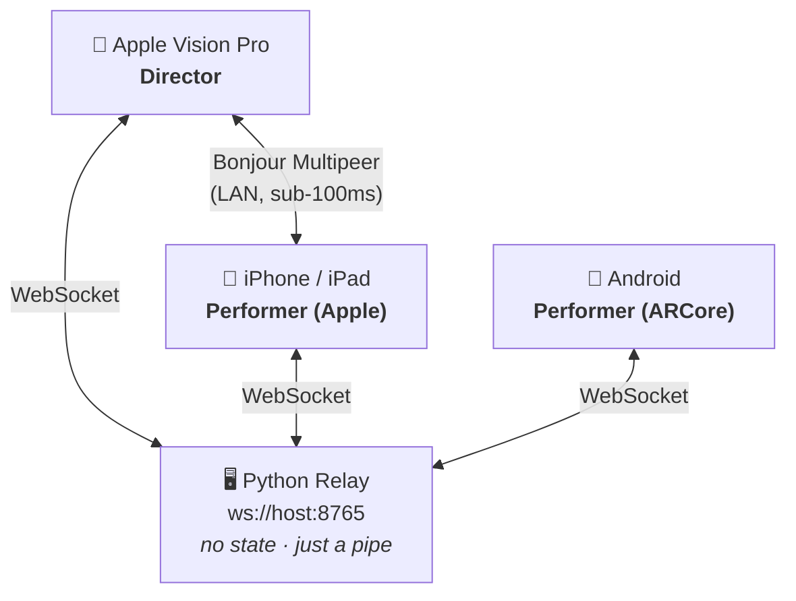

# Connecting Multiple Devices

Understudy is built for **multiplayer**. Two or more devices in the same room (or across the country) can share a stage, see each other as ghost avatars, and react to the same cues.

This is the page that walks you through how that connection works, when to use which transport, and what to expect across platforms.

---

## The two transports

| Transport | When to use it | Performance | Notes |
| ---- | ---- | ---- | ---- |
| **Multipeer (default)** | Apple-only sessions on the same Wi-Fi network | Excellent — sub-100 ms latency in most rooms | Auto-discovery via Bonjour. No setup. |
| **WebSocket relay** | Any session including Android, OR remote rehearsal across the internet | Good — depends on the relay host's connection | Requires a Python relay running somewhere reachable by all clients. |

Both transports speak the same wire format. You can flip between them at runtime via Settings → Transport. Marks, performers, cues — everything continues working without re-authoring.

---

## Multipeer (Apple-only on a LAN)

The default. Just open the app on two Apple devices on the same Wi-Fi network. They'll find each other automatically.

**What "find each other" means:**
- Each device advertises itself over Bonjour as `_und-stage._tcp`
- Devices in the same room code (`Settings → Room`) connect peer-to-peer
- "Same room code" gates connection. If you and a colleague want different rehearsals running simultaneously in the same building, use different room codes.

You'll see the **peer count** update in the top bar of the app: *"Room: rehearsal · 2 peers"*.

### Pros
- Zero setup. Open the app on two iPhones, they connect.
- Low latency — peer-to-peer, no server hops.
- Works without internet; pure local Wi-Fi or Bluetooth fallback.
- Automatically tolerates one device dropping off and rejoining.

### Cons
- Apple devices only. Android can't participate.
- Wi-Fi networks with client isolation enabled (some hotel and corporate networks) block this.
- Doesn't traverse subnets — directors in the same building but on different VLANs won't find each other.

---

## WebSocket relay (mixed platform, remote rehearsal)

When you need Android in the session, or you want to rehearse across the internet, switch to WebSocket.

### Run the relay

The relay is a single Python file. From the repo:

```bash
cd relay
python3 -m venv .venv && source .venv/bin/activate
pip install -r requirements.txt
python3 server.py
# Understudy relay starting on ws://0.0.0.0:8765
```

Run it on any always-on machine — a Mac on the LAN, a Linux box on a NAS, a $5/mo VPS. The relay just rebroadcasts JSON between clients in the same room; it doesn't store anything.

### Point every device at it

In **every device**, open Settings → Transport → **WebSocket**, and enter:

```
ws://<relay-host-lan-ip>:8765
```

Or, for remote rehearsal, the public hostname / IP.

The "peers" count will update once everyone is connected.

> **Same room code, same blocking.** WebSocket sessions still scope by `Settings → Room`. Set it to the same value on every device in the rehearsal, including the Android performer.

### Pros
- Includes Android.
- Works across the internet (LAN-restricted firewalls aside).
- Single relay endpoint is easier to admin than peer-to-peer when something goes wrong.

### Cons
- Requires running the relay somewhere.
- Latency depends on the relay's network proximity. Aim for the relay to be on the same continent as your performers.
- The relay is a single point of failure — if it goes down, everyone disconnects.

---

## Mixed iOS + visionOS + Android

The whole point. A typical session looks like:



Apple devices run **both** transports simultaneously — Multipeer between themselves AND WebSocket if you've set Transport = WebSocket. You can configure all three platforms in the same session: Apple director on visionOS, Apple performer on iPhone, Android performer on a Pixel.

The wire format is identical. A mark dropped on visionOS with Multipeer reaches an iPhone via Multipeer AND an Android via the WebSocket relay simultaneously, with no special handling.

> **Wire-format compatibility** is enforced by `test-fixtures/` — Swift-generated JSON round-trips through both Swift and Kotlin decoders. Check there if you ever wonder "would a v0.8 camera-mark round-trip cleanly through a v0.7 Android client?" — the answer is yes, but the fixtures prove it.

---

## Calibration

Every device starts with its own AR origin — the ARKit / ARCore world frame is different on every phone. Without calibration, a mark dropped on one phone lands in a different physical spot on every other phone. Multiplayer is broken.

Two ways to fix it.

### Compass ceremony (manual, simple, error-prone)
1. Everyone stands at the agreed-upon stage centre.
2. Everyone faces upstage.
3. Everyone taps the **compass icon** in the top bar of their app **at the same time**.

The compass turns green on every device. The current device pose becomes "stage centre, facing upstage" and every mark from now on is in the shared frame.

Works in the moment, but slightly fragile — if one performer's compass tap was a metre off, their version of the stage will drift.

### QR target (precise, automatic, recommended)
1. The visionOS director opens the **QR Target** window from the room row → a bright-white QR code appears (or you can print one — payload is `understudy://calibrate`, 210 mm wide, available in the iPhone Settings sheet too).
2. Performers point their phones at the target. ARKit / ARCore detects the image automatically and writes a calibration the moment the camera sees it.
3. Compass turns green. No tap needed.

This is precise — the QR's exact world transform feeds directly into the calibration matrix. Multi-device sessions feel rock-solid.

The two methods can coexist. If you have ten iPhones in a room and only one of them missed the QR, that one can use the manual compass ceremony.

---

## What broadcasts over the wire

For the curious — here's what happens on every cue, every move, every edit:

| Action | Message | Direction |
| ---- | ---- | ---- |
| You move | `performerUpdate(pose, quality, currentMarkID)` | every other device, ~10 Hz |
| You drop a mark | `markAdded(mark)` | every other device |
| You edit a mark | `markUpdated(mark)` | every other device |
| You delete a mark | `markRemoved(id)` | every other device |
| You import a blocking | `blockingSnapshot(blocking)` | every other device, who replace local state if newer |
| Director recordings | `playbackState(t: 0…1)` | every other device, drives the ghost |
| LiDAR scan | `roomScanUpdated(scan)` + `roomScanOverlay(pose)` | every other device |

Cues fire **locally** — every device computes whether you crossed a mark and fires its own SFX / light / OSC. There's no central "fire this cue" message; the trigger is purely positional.

For the wire format details, see [PROTOCOL.md in the repo](https://github.com/ibrews/Understudy/blob/main/PROTOCOL.md).

---

## Mission Control integration

Understudy advertises itself on the AgileLens fleet's **Mission Control** monitoring system over the same Bonjour layer (`_agilelens-mon._tcp`). If you're running the Mission Control app on a Mac in the same building, every Understudy session will appear automatically — director, performers, marks, room scan mesh, real-time movement.

This is fleet-only infrastructure (it integrates Understudy with Agile Lens's other multiplayer apps — WhoAmI, LaserTag, SharedScanner). External users can ignore it; it doesn't change anything about how Understudy itself works.

---

## Tips for multi-device sessions

- **Calibrate before you do anything else.** The single biggest cause of "the marks are in the wrong spot" is skipped calibration.
- **Pick a transport and stick with it for the whole session.** Switching mid-session works but causes a brief disconnect.
- **Run the relay on a wired Mac if you can.** Python on a wired connection trumps Wi-Fi reliability for a relay host.
- **The director's room code is the source of truth.** Send it to every performer before rehearsal — by AirDrop, text, or a sign on the wall.
- **If a performer disconnects, they rejoin automatically when the network returns.** They'll need to re-calibrate (the calibration is per-device, not broadcast).

---

## Where to next

- **[Director's Guide](Director-Guide)** — running rehearsal in Vision Pro.
- **[Room Scanning](Room-Scanning)** — capturing a venue and aligning it across devices.
- **[Troubleshooting](Troubleshooting#calibration-and-connectivity)** — when something doesn't connect.
