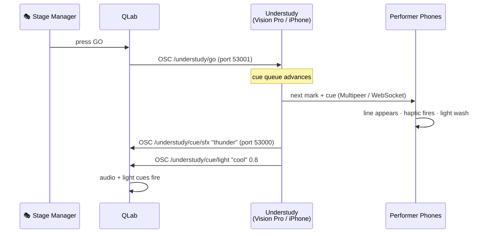

# Showrunning with QLab (OSC Bridge)

Understudy speaks **OSC** — the show-control protocol used by QLab, TouchDesigner, Max/MSP, and many lighting consoles. This page covers both directions:

- **Outbound:** when an Understudy mark fires, send the cue out to QLab so QLab's lighting / sound / video cues fire in lockstep.
- **Inbound:** when a stage manager hits GO in QLab, advance Understudy's cue stack — your performers' phones get the next line, the next light wash, the next beat.

The whole loop is bidirectional. Walk → fire → QLab → fire → walk.

---

## Why this exists

In a real production, the stage manager calls cues from a desk. QLab lights the lights, plays the music, runs the projection. Understudy sits in front of all of that for the rehearsal layer — performers' phones plus the director's headset.

Without an OSC bridge, you'd have to author your show twice (once in Understudy, once in QLab) and time them by hand. The bridge means **one source of truth**: whoever's authoring the blocking can author the cue numbers too, and QLab obeys.

---

## Outbound — Understudy → QLab

### What gets sent

When a cue fires (because a performer walked onto a mark), Understudy emits one OSC message per cue type:

| OSC address | Args | When |
| ---- | ---- | ---- |
| `/understudy/mark/enter` | `<name:string> <seqIndex:int>` | One per mark transition (not per cue) |
| `/understudy/cue/line` | `<character:string> <text:string>` | Per `.line` cue |
| `/understudy/cue/sfx` | `<name:string>` | Per `.sfx` cue |
| `/understudy/cue/light` | `<color:string> <intensity:float>` | Per `.light` cue |
| `/understudy/cue/wait` | `<seconds:float>` | Per `.wait` cue |
| `/understudy/cue/note` | `<text:string>` | Per `.note` cue |

For the full message format, see [OSC.md in the repo](https://github.com/ibrews/Understudy/blob/main/OSC.md).

### Configuring the outbound bridge

On the device that should send (typically the director's visionOS or a single iPhone running the show — multiple devices sending the same cues will cause QLab to fire each cue twice):

**iPhone:** Settings → **Send OSC to QLab / show control** → ON. Set host (e.g. `192.168.1.50` or `qlab.local`) and port (default `53000`).

**Vision Pro:** Director Panel → **OSC → QLab** row → tap the chip to open settings.

A green dot appears next to the OSC chip when enabled.

### Wiring up QLab

In QLab, create **Network cues** that listen for the addresses above. A typical setup:

| QLab cue | Trigger | Action |
| ---- | ---- | ---- |
| Cue 10 | OSC `/understudy/mark/enter "Francisco's Post" 0` | Light cue: cool blue wash |
| Cue 11 | OSC `/understudy/cue/sfx "thunder"` | Audio file: thunder.wav |
| Cue 12 | OSC `/understudy/cue/light "cool" 0.8` | Light cue: cool wash @ 80% |

Each Understudy → QLab edge is one-way. QLab doesn't know about Understudy state — it only knows "I got this OSC message, fire that cue."

### Test the connection

In Settings (iPhone), with OSC enabled, tap **Send test message**. QLab should receive `/understudy/test "ping from <device-name>"`. If it doesn't:
- Check QLab's OSC listening port (Settings → Network → OSC → Listen on port)
- Verify the host IP is reachable (`ping qlab.local` from a terminal)
- Make sure no firewall is blocking outbound UDP

---

## Inbound — QLab → Understudy

The other direction. The stage manager wants to drive pacing — performers' phones advance to the next line when the SM hits GO, not when the performer happens to step on the next mark.

### What gets received

| OSC address | Args | What it does |
| ---- | ---- | ---- |
| `/understudy/go` (or `/understudy/next`) | none | Fire the next mark's cues |
| `/understudy/back` | none | Move back one mark in the cue stack |
| `/understudy/reset` | none | Reset the GO cursor (next GO fires the first mark) |
| `/understudy/mark` | `<seq:int>` | Jump directly to a specific mark by sequence index |

### Configuring the inbound bridge

iPhone: Settings → **Listen for OSC GO from QLab** → ON. Set listen port (default `53001`). The footer shows: *"Point QLab's OSC destination at this device's LAN IP : port 53001."*

In QLab, create a **Network cue** that sends to that LAN IP : port. Bind it to the space bar:

```
Type: OSC
Destination: 192.168.1.42:53001
Address: /understudy/go
Hot Key: SPACE
```

Now the SM can hit space to advance the show.

### What happens when GO fires

Understudy's `goCursor` (independent of performer movement) advances. The next mark's cues enqueue and dispatch the same way they would on a real walk-on:
- Performer phones see the new line on their teleprompter
- Light cues flash, SFX play
- The outbound OSC mirrors the firings back to QLab — so QLab's own light/sound cues fire on the same edge

This means a typical SM workflow looks like: **press space**. That single keystroke:
1. Sends `/understudy/go` to Understudy
2. Understudy's GO cursor advances
3. The new mark's cues fire on every phone
4. Each cue mirrors back as `/understudy/cue/...`
5. QLab's cue stack receives those mirrors and fires its own design cues

Performer's phone, audience's phone, light board, sound board — all advance on one keystroke.

---

## Manual GO from the director panel

If you don't have a stage manager / QLab at all, the visionOS Director Panel has its own **GO** button (red, big, keyboard shortcut: Return). Press it to advance manually. The orange ⏮ button next to it backsteps.

Same code path — same outbound OSC, same cue firing logic.

---

## A typical wiring diagram



---

## Using OSC for non-QLab tools

The same bridge works with TouchDesigner (just have it listen on the same UDP port for the addresses), Max/MSP, Resolume, Isadora, vMix, ETC Eos consoles, and anything that speaks OSC. Some lighting boards prefer DMX over sACN — see the [DMX-Lighting](DMX-Lighting) page for that.

---

## Troubleshooting

**Test message doesn't arrive.** Check the host IP is correct (use the visionOS Director Panel's Network info). Confirm QLab is on the same Wi-Fi. Try from the simulator with QLab on the same Mac (`localhost:53000`) to isolate the network.

**OSC GO doesn't fire on the listening device.** Check the **Stage Manager (inbound)** toggle is on AND the port matches. The default is 53001; if QLab is sending to 53000 you'll get nothing.

**Cues fire twice in QLab.** Two devices have the outbound bridge enabled. Disable it on all but one — typically the director's headset.

**One performer's cue doesn't sync.** OSC messages fire from a single device's bridge, but every device computes its own cue firings from pose. If a performer's calibration is off, they'll cross a mark at a different time than the OSC bridge fires. Re-calibrate.

---

## Where to next

- **[DMX Lighting](DMX-Lighting)** — fire real fixtures via sACN.
- **[Director's Guide](Director-Guide#osc-and-dmx)** — what OSC looks like in the director panel.
- **[Performer's Guide § Settings](Performer-Guide#settings--the-gear-icon)** — OSC controls on the iPhone.
